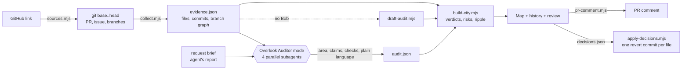

<div align="center">


# Overlook

**AI는 끝났다고 말합니다. 실제로 무엇이 바뀌었는지 확인하세요.**

AI 에이전트가 이미 끝낸 코딩 작업을 감사합니다. 무엇이 바뀌었는지, 요청한 것과 비교하면 어떤지,<br/>그리고 에이전트의 보고가 사실인지.

[English](README.md) · **한국어**

[](https://overlook-lime.vercel.app/)
[](#bob-20으로-만든-과정)
[](LICENSE)
[](package.json)
[](package.json)

[라이브 데모](https://overlook-lime.vercel.app/) · [시작하기](#시작하기) · [IBM Bob 활용](#ibm-bob-활용) · [예시](#예시) · [동작 방식](#동작-방식)


<sub>IBM Bob 2.0 해커톤을 위해 <b>Time Has Density</b> 팀이 만들었습니다.</sub>

</div>

---

## 왜 Overlook인가

AI 코딩 에이전트는 작업 전체를 끝내고 자신 있게 보고합니다. *"완료했습니다. 기사 화면만 바꿨고, API 변경은 없으며, 테스트는 모두 통과합니다."* 리뷰어는 이 보고를 그냥 믿거나, 사실인지 확인하려고 변경 전체를 읽어야 합니다.

에이전트는 요청 밖의 코드를 자주 건드립니다. 공용 헬퍼, API 직렬화 코드, 자기가 "고친" 테스트 기대값 같은 것들입니다. 이런 변경은 아무도 요청하지 않은 화면과 계약으로 번지고, 에이전트가 일하는 동안 다른 사람이 합친 작업과 부딪히기도 합니다. Overlook은 리뷰어가 합치기 전에 묻는 네 가지 질문에 답합니다.

1. **에이전트가 요청 범위 안에서만 작업했는가?**
2. **보고가 사실인가?**
3. **원래 테스트가 여전히 통과하는가?**
4. **무엇을 결정해야 하는가?**

## 기능

- **링크만 붙여 넣으면 실행됩니다.** 풀 리퀘스트, compare, 커밋, 저장소 주소 중 하나면 됩니다. 범위는 링크에서, **요청**은 PR이 닫는 이슈(`Fixes #724`)에서, **에이전트 보고**는 PR 설명에서 가져옵니다. 저장소 링크는 가장 최근 작업을 감사하고, 이미 합쳐진 PR은 원래 브랜치를 되살려 감사합니다.
- **모델이 아니라 git에서 나온 증거.** 의존성 없는 수집기가 `base..head`를 읽습니다. 바뀐 파일, 커밋, 다시 쓰이거나 약해진 테스트, API 파일, import 관계(JavaScript/TypeScript, Go, Python), 작업 주변의 브랜치 흐름까지 모읍니다.
- **코드베이스를 지도로.** 폴더는 블록, 파일은 건물이고, 판정에 따라 색이 칠해집니다. 파랑은 요청 범위 안, 빨강은 범위 밖, 주황은 영향 받을 수 있음입니다. 요청 범위는 파란 점선 울타리로 표시됩니다.
- **모든 커밋을 바로 이전 커밋과 비교.** 아래 기록 막대가 브랜치를 git 그래프로 보여줍니다. 작업을 커밋 단위로 재생하거나, 어느 브랜치의 어떤 커밋이든 눌러서 무엇이 바뀌었는지 볼 수 있습니다.
- **테스트는 보고가 아니라 실행으로.** base 시점의 *원래* 테스트를 base의 테스트 명령 그대로, 에이전트 코드 위에서 임시 작업 폴더에 돌립니다. 실행하기 전까지 "테스트 모두 통과"는 *확인 안 됨*으로 남습니다.
- **결정, 되돌리기, 영수증.** 범위 밖 변경마다 승인하거나 되돌립니다. 결정은 파일당 하나의 되돌리기 커밋이 되고, 영수증이 PR 댓글로 남습니다.
- **증거가 판정하고, Bob이 설명합니다.** IBM Bob이 요청을 읽고 요청 범위를 제안하며, 보고를 주장 단위로 나누고, 실행 가능한 검사를 작성합니다. git으로 확인할 수 있는 사실은 모두 계산으로 정하고 Bob에게 맡기지 않습니다.

## 시작하기

### 라이브 데모

[overlook-lime.vercel.app](https://overlook-lime.vercel.app/)에서 GT-142 샘플과 모든 예시를 로그인이나 키 없이 열 수 있습니다. 정적 사이트라 API가 없고 모델도 돌지 않습니다.

### GitHub 링크 감사하기

Node.js 22 이상과 git이 필요합니다. npm 의존성은 없습니다.

```bash
git clone https://github.com/JONGSKY/Overlook.git
cd Overlook
npm run site        # http://localhost:4280
```

풀 리퀘스트, compare, 커밋, 저장소 주소를 붙여 넣으면 가져와서 감사하고 결과를 엽니다. 보통 몇 초면 되고, 큰 저장소는 처음 복제할 때 1분 정도 걸립니다. 이 실행은 모델 없이 로직만으로 돌아가며 **Draft audit**으로 표시됩니다.

> `GITHUB_TOKEN`을 설정하면 GitHub API 호출 한도가 늘어납니다. *Choose them yourself*에서 커밋, 요청, 보고, 범위를 직접 정하거나 Bob이 만든 `out/audit.json`을 불러올 수 있습니다.

### IBM Bob과 함께

Bob IDE에서 이 저장소를 열고 **Overlook Auditor** 모드를 고른 뒤 실행합니다.

```
/audit ../my-app <base-sha> brief/GT-142.docx "Done. I only changed the article views. No API changes. All tests pass."
```

Bob이 증거를 모으고, 하위 에이전트 네 개를 동시에 돌려 `out/audit.json`을 쓰고, `overlook_build`로 감사 결과를 올립니다. 지도 링크와 영수증을 받게 됩니다.

## IBM Bob 활용

### 제품 안에서

| | Bob 없이 (로직만) | Overlook Auditor 모드 사용 |
|---|---|---|
| 지도, 파일 목록, 브랜치 그래프, 재생, 브랜치 비교 | ✅ | ✅ |
| 요청 범위 안/밖, 영향 받을 수 있음, 위험도 | ✅ 범위를 정한 뒤 | ✅ |
| 원래 테스트 실행, 되돌리기, 영수증 | ✅ | ✅ |
| **요청 범위** | 요청 문장의 폴더·파일 이름으로 추정 | 요청서를 읽고 근거와 함께 제안 |
| **보고를 주장으로 나누기** | 문장마다 하나 | 쪼갤 수 없는 단위로, 종류 구분 |
| **기능 주장** ("X를 고쳤다") | *확인 안 됨* | 실행 가능한 검사, 종료 코드가 판정 |
| **쉬운 말 설명** | 없음 | 변경마다 리뷰어를 위한 한 문장 |

| Bob 기능 | Overlook에서의 역할 | 위치 |
|---|---|---|
| **사용자 정의 모드** | `overlook-auditor`는 모든 것을 읽되 `out/`에 감사 결과만 쓸 수 있고, `overlook-fixer`는 요청 범위 안에서만 다시 구현 | [`.bob/custom_modes.yaml`](.bob/custom_modes.yaml) |
| **모드 규칙** | 증거부터 수집, git으로 확인 가능한 판정은 직접 정하지 않음, 문제를 누그러뜨리지 않음 | [`.bob/rules-overlook-auditor/`](.bob/rules-overlook-auditor/) |
| **병렬 하위 에이전트** | 요청 범위, 주장, 검사, 쉬운 말 설명을 동시에 처리 | 감사 규칙 3단계 |
| **스킬** | `fence-mapper`, `claim-extractor`, `feature-check`, `business-translate` | [`.bob/skills/`](.bob/skills/) |
| **문서 이해** | 요청서 `.docx`를 Bob이 직접 읽음 | [`brief/GT-142.docx`](brief/GT-142.docx) |
| **MCP 서버** | `overlook_collect`, `overlook_build`, `overlook_fence`, `overlook_verify`, `overlook_receipt`, `overlook_apply`, `overlook_audits` | [`engine/mcp.mjs`](engine/mcp.mjs), [`.bob/mcp.json`](.bob/mcp.json) |
| **슬래시 명령** | `/audit`, `/verify`, `/fix-forward`, `/receipt` | [`.bob/commands/`](.bob/commands/) |
| **프로젝트 규칙, AGENTS.md** | 엔진은 의존성 없이, UI는 정적으로, 샘플은 재현 가능하게 | [`.bob/rules/`](.bob/rules/), [`AGENTS.md`](AGENTS.md) |

### Bob 2.0으로 만든 과정

Bob 2.0은 제품 안에서만이 아니라 프로젝트의 모든 단계에서 쓰였습니다. 팀 계정 세 개가 각자 40 Bobcoin 예산을 다 쓸 때까지 작업을 돌렸습니다.

| 단계 | Bob 2.0 | Bob이 한 일 |
|---|---|---|
| 시작 | Agent 모드, `office-insights` 스킬 | 명세, Word 문서로 된 요청서, 첫 Auditor 모드·규칙·스킬 작성 |
| 계획 | Plan 모드, 문서 이해 | `.docx` 요청서를 읽고 [`docs/PLAN.md`](docs/PLAN.md) 작성: 단계, 완료 기준, 수용 매트릭스, Bobcoin 예산 |
| 구축 | Agent 모드, 하위 작업 7개 | 첫 버전을 단계별로 구축. 하위 작업마다 새 맥락에서 시작하고 단계마다 커밋 |
| 수정 | Agent 모드, 두 번째 계정 | 리뷰 지적 사항 반영: 테스트 수집, 이중 언어 문구, 되돌리기 커밋, UI, 샘플 |
| 리뷰 | Agent 모드 | 완성된 코드 전체 리뷰: 쓰지 않는 코드 제거, 버그 수정, 테스트 보강, 원래 테스트 명령을 base에서 가져와 테스트 스크립트를 바꿔 통과를 꾸미지 못하게 함 |

**계정 3개, 작업 4개, 119.03 Bobcoin.** 계정별 세션 요약은 [`bob_sessions/`](bob_sessions/), Task Id와 단계별 사용량은 [`docs/BOB_SESSIONS.md`](docs/BOB_SESSIONS.md), Bob이 만든 파일은 [`BOB_CONTRIBUTIONS.md`](BOB_CONTRIBUTIONS.md), 첫 버전이 지금 버전으로 자란 과정은 [`docs/EVOLUTION.md`](docs/EVOLUTION.md)에 있습니다.

## 작업 화면 둘러보기


| 영역 | 질문 | 보여주는 것 |
|---|---|---|
| **위** | 지금 상태는? | 판정(*Needs your review*, *Check the report*, *Ready to merge*, *Looks clean*)과 네 가지 숫자: 범위 밖, 영향 받을 수 있음, 사실인 주장, 원래 테스트 |
| **왼쪽** | 무엇이 바뀌었나? | 이 작업이 건드린 파일만 폴더 트리로, 판정 색과 함께. 다른 커밋을 볼 때는 그 커밋의 파일이 맨 위에 |
| **지도** | 어디서? | 요청 범위가 파란 울타리로 둘러진 도시. Before / Compare / After, Layers 메뉴 |
| **오른쪽** | 괜찮은가? | 한 번에 카드 하나: 네 가지 질문, 선택한 파일(표시된 이유, 영향 범위, 변경 내용, **Approve / Revert**), 또는 보고 있는 커밋 |
| **아래** | 어떻게 진행됐나? | 브랜치 기록. 헤더에서 패널을 켜고 끕니다(Shift+1 / Shift+3 / Shift+2) |

**재생.** 기록 막대 오른쪽 위 ▶로 작업을 커밋 단위로 재생합니다(1× · 2× · 0.5×). 지도는 커밋마다 해당 건물을 밝히고, 오른쪽 카드는 그 커밋을 바로 이전 커밋과 비교합니다.


**어느 브랜치의 어떤 커밋이든.** base 브랜치나 다른 브랜치의 커밋을 누르면, 카드·지도·트리·위 줄이 그 커밋이 이전 커밋 대비 무엇을 바꿨는지, 그중 이 작업도 바꾼 파일이 무엇인지 보여줍니다.


**브랜치와 작업 비교.** 양쪽이 모두 바꾼 파일은 합칠 때 충돌할 수 있는 곳입니다. 초록 점선은 작업이 실제로 합쳐진 지점입니다.


**변경 검토.** 왜 표시됐는지, 무엇에 영향을 줄 수 있고 왜 그런지, 변경 내용을 본 뒤 Approve 또는 Revert를 고릅니다.


<details>
<summary><b>지도와 기록 막대 읽는 법</b></summary>

| 지도에서 | 의미 |
|---|---|
| 건물 높이 · 밝은 윗부분 | 코드 줄 수 · 그중 이 작업이 바꾼 비율 |
| 파란 건물 | 요청 범위 안에서 바뀜 |
| `!` 핀이 달린 빨간 건물 | 요청 밖에서 바뀜: 결정 필요 |
| 빗금 고리 안의 주황 건물 | 직접 바뀌지 않았지만 바뀐 파일을 가져다 씀: **영향 받을 수 있음** |
| 빨강·파랑·주황 블록 옆면 | 그 폴더에 범위 밖 변경, 범위 안 변경, 영향 받을 수 있는 파일이 있음 |
| 보라 건물 | 보고 있는 커밋의 파일 중 이 작업이 바꾸지 않은 파일 |
| 점선 윤곽 | 새 파일, 또는 되돌리기 전 높이 |
| 파란 점선 테두리 | 요청 범위 |

| 기록 막대에서 | 의미 |
|---|---|
| 줄 | 같은 기간의 다른 브랜치, base 브랜치, 감사 중인 브랜치 |
| 점선 띠 · 번호 원 | 이 작업과 그 커밋들. 요청 범위를 벗어난 커밋은 빨강 |
| 초록 점선 "PR #n merged" | 작업이 base 브랜치에 들어간 지점 |
| base 브랜치의 보라 고리 | 다른 PR을 합친 커밋 |
| 작업 안의 보라 점선 원 | base 브랜치를 작업 브랜치로 합친 커밋 |

</details>

## 예시

**실제 감사.** 공개 저장소에서 에이전트가 끝낸 실제 작업입니다(`samples/real/`, `npm run real`로 다시 만듦). 요청과 에이전트 보고는 원문을 인용했고, git으로 확인할 수 있는 판정은 모두 git에서 계산했습니다.

| 예시 | 출처 | Overlook이 찾은 것 | 감사자 |
|---|---|---|---|
| github-mcp-server #1645 | [github/github-mcp-server](https://github.com/github/github-mcp-server/pull/1645) (Copilot) | 호환성 수정이 테스트 기대값과 도구 스냅샷 5개까지 다시 씀: 파일 7개 중 5개가 범위 밖, "테스트 통과"는 일부만 사실 | Overlook 팀 |
| playwright-mcp #725 | [microsoft/playwright-mcp](https://github.com/microsoft/playwright-mcp/pull/725) (Copilot) | 범위 안이지만, 설명에는 나중 커밋이 되돌린 변경이 여전히 적혀 있음. 하루 뒤 squash 병합 | Overlook 팀 |
| Atlas · Bob 세션 10 | [chanjoongx/atlas](https://github.com/chanjoongx/atlas) (IBM Bob 해커톤 2026년 5월, 2위) | main에 바로 커밋. Bob은 프롬프트가 지정한 파일 4개 안에서만 작업 | **IBM Bob** (Overlook Auditor 모드) |

**대본 예시.** 스크립트로 만든 git 이력을 같은 엔진으로 감사한 예시입니다(`npm run sample`, `npm run examples`). 실제 에이전트 실행으로 소개하지 않습니다.

| 예시 | 요청 | 보여주는 것 |
|---|---|---|
| GT-142 (샘플) | 상대 시간으로 게시일 표시 | 변경 6개 중 4개가 범위 밖, 3개 파일 영향 가능, 다시 쓰인 테스트, 주장 4개 중 1개만 사실 |
| `infra-drift` | SET-88 · 설정의 다크 모드 토글 | 작은 UI 기능이 테마 토큰, `.env.example`, `config/env.ts`, `docker-compose.yml`, Terraform, CI까지 바꿈: 10개 중 7개 범위 밖 |
| `monorepo-scale` | ADM-310 · Customer를 Client로 이름 변경 | 파일 625개 모노레포에서 이름 변경이 공용 타입, 공개 API, 마이그레이션까지 번짐: 13개 범위 밖, 94개 영향 가능 |
| `clean-pass` | PAY-17 · 결제 합계 반올림 수정 | 대조군: 모두 범위 안, 모든 주장이 사실 |


## 동작 방식



자세한 구조와 데이터 계약: [`docs/architecture.md`](docs/architecture.md), [`SPEC.md`](SPEC.md) (영문).

<details>
<summary><b>저장소 구조와 명령</b></summary>

```
.bob/                  IBM Bob 설정: 모드, 규칙, 스킬, 슬래시 명령, MCP 서버
AGENTS.md              Bob이 모든 모드에서 읽는 안내
bob_sessions/          팀 계정별 Bob 작업 세션 요약
brief/GT-142.docx      데모 요청서
engine/                sources, collect, core/city, build-city, draft-audit, verify,
                       apply-decisions, pr-comment, site, mcp, scan, 테스트
schema/                audit.schema.json, Bob 감사 결과의 계약
samples/               대본 GT-142 샘플, examples/ 대본 예시, real/ 실제 감사
ui/                    빌드 없는 정적 사이트: index.html, app.js, workspace.js, atlas3d.js,
                       history-graph.js, map.js, iso.js, layers.js, util.js, styles.css
docs/                  구조, 계획, Bob 세션, 발전 과정, 지표, 측정, 스크린샷
```

```bash
npm test          # node:test: 수집기, 브랜치 그래프, 병합, import, 판정, 테스트 실행, 되돌리기,
                  #            영수증, 사이트 API, MCP 서버, 예시
npm run site      # 로컬 사이트와 API (http://localhost:4280)
npm run mcp       # stdio MCP 서버 (.bob/mcp.json에 설정됨)
npm run sample    # GT-142 샘플 다시 만들기
npm run examples  # 대본 예시 다시 만들기
npm run real      # 실제 감사 다시 만들기 (공개 저장소를 복제)
npm run scan      # GitHub API로 공개 에이전트 PR 측정
```

</details>

## 지표

- **공개 에이전트 PR 측정:** [`docs/measurements.md`](docs/measurements.md)에서 Copilot, Codex, Devin 에이전트가 만든 병합된 PR 22개에 같은 규칙을 적용했습니다. 20개 중 15개가 테스트 파일을 바꿨고 6개가 테스트 기대값을 다시 썼으며, 테스트를 약하게 만든 경우는 없었습니다. 한계도 함께 적었습니다 (영문).
- **리뷰 시간과 정확도:** 측정 방법은 [`docs/metrics.md`](docs/metrics.md)에 있습니다. 숫자는 실제로 잰 뒤에만 채웁니다.

## 데이터와 라이선스

대본 예시는 이 프로젝트가 만든 저장소입니다. 실제 감사는 MIT 또는 Apache-2.0 라이선스의 공개 저장소를 인용합니다. 고객 데이터, 회사 기밀, 개인정보는 쓰지 않습니다.

[MIT 라이선스](LICENSE)로 공개합니다.

## 팀

**Time Has Density**

| 멤버 | GitHub |
|---|---|
| Jongho Lee | [@JONGSKY](https://github.com/JONGSKY) |
| Asher | [@asher-han](https://github.com/asher-han) |
| seokyoung0213 | (Bob 계정) |
