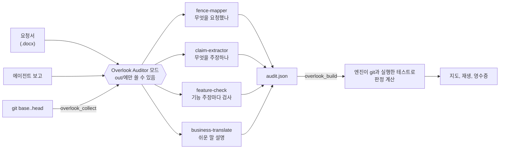
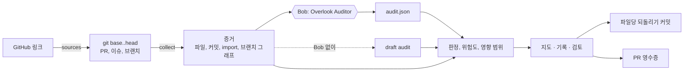

<div align="center">


# Overlook

### AI는 끝났다고 말합니다. 실제로 무엇이 바뀌었는지 보세요.

[English](README.md) · **한국어**

[](https://overlook-lime.vercel.app/)

[](#ibm-bob-20으로-만들었습니다)
[](engine/test)
[](package.json)
[](LICENSE)

</div>

<br/>

이제 AI 에이전트는 티켓 하나를 받아 완성된 풀 리퀘스트로 돌아옵니다. 보고는 늘 그럴듯합니다. *"완료했습니다. 기사 화면만 바꿨고, API 변경은 없고, 테스트는 모두 통과합니다."* 그런데 정말일까요? 지금은 변경 전체를 읽어 보거나, 아니면 모른 채 넘어갑니다.

**Overlook이 에이전트의 작업을 대신 검토합니다.** GitHub 링크를 붙여 넣으면, 에이전트가 실제로 바꾼 것을 보여주고, 요청한 내용과 비교하고, 보고의 문장 하나하나를 git으로 확인합니다. 그다음 무엇을 남기고 무엇을 되돌릴지 정하면 됩니다.

<div align="center">


</div>

## 이렇게 보입니다

코드베이스가 하나의 도시가 됩니다. 폴더는 블록, 파일은 건물입니다. 파랑은 요청 범위 안에서 바뀐 것, 빨강은 범위 밖에서 바뀐 것, 주황은 직접 바뀌진 않았지만 바뀐 파일에 기대고 있는 것입니다.

<table>
  <tr>
    <td width="50%" valign="top"><br/><b>에이전트가 범위 안에서만 일했나?</b><br/>요청 범위는 파란 울타리로 둘러져 있습니다. 빨간 건물은 아무도 요청하지 않은 변경입니다.</td>
    <td width="50%" valign="top"><br/><b>이 변경이 무엇을 깨뜨리나?</b><br/>건물을 누르면 표시된 이유, 이 파일에 기대는 파일, 변경 내용, 그리고 Approve / Revert가 나옵니다.</td>
  </tr>
  <tr>
    <td width="50%" valign="top"><br/><b>어떻게 여기까지 왔나?</b><br/>작업을 커밋 단위로 재생하면서 어디서 범위를 벗어났는지 봅니다.</td>
    <td width="50%" valign="top"><br/><b>팀의 다른 작업과 부딪히나?</b><br/>아무 브랜치나 작업과 비교해서 양쪽이 모두 건드린 파일을 찾습니다.</td>
  </tr>
</table>

## 왜 필요한가

에이전트는 빠르고, 요청받은 부분은 대체로 잘 해냅니다. 문제는 그 밖입니다. 공용 날짜 헬퍼를 "정리"하고, 지나가는 길에 API 직렬화 코드를 손보고, 실패하던 테스트 기대값을 조용히 바꿔서 통과시킵니다. 변경 하나하나는 diff에서 별것 아니어 보이지만, 모이면 아무도 건드릴 생각이 없던 화면과 계약까지 번집니다.

이 문제를 가장 크게 느끼는 사람들은 이렇습니다.

- **리뷰어와 테크 리드:** 한 줄씩 읽을 수 있는 것보다 많은 에이전트 PR을 승인해야 합니다.
- **프로덕트 오너:** 요청은 직접 썼지만 diff를 읽을 수 없어서, 나온 결과가 요청한 그대로인지 확인할 방법이 없습니다.
- **에이전트를 여러 개 동시에 돌리는 팀:** 브랜치들이 예상치 못한 곳에서 겹칩니다.

Overlook은 합치기 전에 네 가지에 답합니다. **에이전트가 범위 안에서만 일했는지, 보고가 사실인지, 원래 테스트가 여전히 통과하는지, 무엇을 결정해야 하는지.**

## 실제로 돌려 본 결과

만든 데모 하나만으로 주장하고 싶지 않아서, 실제 에이전트 작업에도 Overlook을 돌렸습니다.

| | 결과 |
|---|---|
| **GT-142**, 우리가 만든 데모 작업 | 보고는 "기사 화면만, API 변경 없음, 테스트 모두 통과"였습니다. Overlook은 **바뀐 파일 6개 중 4개가 요청 범위 밖**, 공용 헬퍼를 통해 **파일 3개가 추가로 영향**, API 직렬화 변경, 다시 쓰인 테스트를 찾았습니다. **주장 4개 중 1개만 사실**이었습니다. |
| GitHub 공식 MCP 서버의 **Copilot 에이전트 PR** ([#1645](https://github.com/github/github-mcp-server/pull/1645)) | 호환성 수정이 테스트 기대값과 도구 스냅샷 5개까지 다시 썼습니다. **파일 7개 중 5개가 범위 밖**, "테스트 통과"는 일부만 사실입니다. |
| Microsoft Playwright MCP의 **Copilot 에이전트 PR** ([#725](https://github.com/microsoft/playwright-mcp/pull/725)) | 범위 안에서 작업했지만, 설명에는 나중 커밋이 되돌린 변경이 여전히 적혀 있습니다. |
| GitHub API로 측정한 **병합된 에이전트 PR 22개** (Copilot, Codex, Devin) | **20개 중 15개**가 테스트 파일을 바꿨고 **6개**가 테스트 기대값을 다시 썼습니다. 자세한 내용과 한계는 [`docs/measurements.md`](docs/measurements.md) (영문). |

## IBM Bob 2.0으로 만들었습니다

Bob은 이 프로젝트에서 두 가지 역할을 합니다. 제품 안의 감사관이고, 이 제품을 함께 만든 팀원입니다.

### 제품 안의 Bob

처음부터 규칙은 하나였습니다. **증거가 판정하고, Bob이 설명한다.** 어떤 파일이 바뀌었는지, API 파일을 건드렸는지, 테스트를 다시 썼는지처럼 git으로 증명할 수 있는 것은 모두 모델 없이 코드로 계산합니다. Bob은 판단이 필요한 일을 맡습니다. 요청을 읽고, 무엇을 요청했는지 선을 긋고, 에이전트 보고를 확인 가능한 주장으로 나누고, 기능 주장마다 검사를 쓰고, 변경마다 쉬운 말로 설명합니다.



| Bob 2.0 기능 | Overlook에서의 쓰임 | 위치 |
|---|---|---|
| 사용자 정의 모드 | **Overlook Auditor**는 모든 것을 읽되 감사 결과만 쓸 수 있어서, 감사하는 대상을 몰래 "고칠" 수 없습니다. **Overlook Fixer**는 리뷰 뒤에 요청 범위 안에서만 다시 구현합니다. | [`.bob/custom_modes.yaml`](.bob/custom_modes.yaml) |
| 병렬 하위 에이전트 | 범위, 주장, 검사, 쉬운 말 설명을 각자 깨끗한 맥락에서 동시에 처리 | [감사 규칙](.bob/rules-overlook-auditor/01-evidence-first.md) |
| 스킬 | 감사 단계 4개(`fence-mapper`, `claim-extractor`, `feature-check`, `business-translate`)와 한 번에 부르는 작업 4개(`audit`, `verify`, `receipt`, `fix-forward`) | [`.bob/skills/`](.bob/skills/) |
| 문서 이해 | 요청이 실제 티켓처럼 Word 문서로 들어옵니다 | [`brief/GT-142.docx`](brief/GT-142.docx) |
| MCP 서버 | `overlook_collect`부터 `overlook_apply`까지 도구 7개로 Bob이 엔진을 직접 다룹니다 | [`engine/mcp.mjs`](engine/mcp.mjs) |
| 슬래시 명령 | `/audit`, `/verify`, `/fix-forward`, `/receipt` | [`.bob/commands/`](.bob/commands/) |
| 모드 규칙 | 증거부터 모으고, git으로 확인 가능한 판정은 직접 정하지 않고, 문제를 누그러뜨리지 않음 | [`.bob/rules-overlook-auditor/`](.bob/rules-overlook-auditor/) |

Bob 없이도 Overlook은 로직만으로 돌아가며 결과를 **Draft audit**으로 표시합니다. 지도, 기록, git으로 계산할 수 있는 판정은 모두 나오지만, 요청 범위는 추정일 뿐이고 기능 주장은 *확인 안 됨*으로 남습니다. 아래 예시 중 Atlas는 Bob이 Overlook Auditor 모드로 직접 감사한 결과입니다.

### Bob과 함께 만든 과정

팀 계정 세 개가 각자 40 Bobcoin 예산을 다 쓸 때까지 Bob을 돌렸습니다. Plan 모드로 계획을 세우고, Agent 모드로 코드와 테스트를 짜고, 서비스를 띄워 확인하고, 다시 고쳤습니다.

| | Bob 2.0 | Bob이 한 일 |
|:---:|---|---|
| **시작** | Agent 모드, `office-insights` 스킬 | 명세와 Word 요청서를 쓰고, 첫 Auditor 모드·규칙·스킬을 구성 |
| **계획** | Plan 모드, 문서 이해 | 요청서를 읽고 [`docs/PLAN.md`](docs/PLAN.md) 작성: 단계, 완료 기준, 수용 매트릭스, Bobcoin 예산 |
| **구축** | Agent 모드, 하위 작업 7개 | 첫 버전을 단계별로 구축. 하위 작업마다 새 맥락, 단계마다 테스트와 커밋 |
| **수정** | Agent 모드, 두 번째 계정 | 리뷰 목록을 반영하고 샘플을 다시 생성 |
| **리뷰** | Agent 모드 | 완성된 코드 전체를 읽고 쓰지 않는 코드를 지우고 테스트를 보강. 에이전트가 테스트 스크립트를 바꿔 "통과"를 꾸밀 수 있는 구멍도 막음 |

<table>
  <tr>
    <td align="center"><br/><sub>시작 · 7.00</sub></td>
    <td align="center"><br/><sub>계획과 구축 · 39.55</sub></td>
    <td align="center"><br/><sub>수정 · 39.95</sub></td>
    <td align="center"><br/><sub>리뷰 · 32.53</sub></td>
  </tr>
</table>

**작업 4개 · 계정 3개 · 이 작업들에 119 Bobcoin, 모든 계정의 예산 소진.** Bobcoin은 판단이 필요한 곳에만 쓰고 사실은 모두 코드로 계산했으며, 단계마다 새 작업을 열어 맥락을 작게 유지했습니다. 팀원별 세션 화면은 [`bob_sessions/`](bob_sessions/), Task Id는 [`docs/BOB_SESSIONS.md`](docs/BOB_SESSIONS.md), Bob이 만든 파일은 [`BOB_CONTRIBUTIONS.md`](BOB_CONTRIBUTIONS.md), 첫 프로토타입에서 지금 버전까지의 과정은 [`docs/EVOLUTION.md`](docs/EVOLUTION.md)에 있습니다.

## 써 보기

**지금 바로 브라우저에서.** [overlook-lime.vercel.app](https://overlook-lime.vercel.app/)에서 데모와 모든 예시를 열 수 있습니다. 로그인도 키도 필요 없습니다.

**아무 GitHub 링크로.** Node.js 22 이상과 git만 있으면 됩니다. 따로 설치할 것은 없습니다.

```bash
git clone https://github.com/JONGSKY/Overlook.git
cd Overlook
npm run site
```

http://localhost:4280 을 열고 풀 리퀘스트, compare, 커밋, 저장소 링크 중 하나를 붙여 넣으세요. 요청은 PR이 닫는 이슈에서, 보고는 PR 설명에서 읽어 몇 초 만에 지도를 띄웁니다(큰 저장소는 처음 한 번 1분 정도). GitHub API 한도에 걸리면 `GITHUB_TOKEN`을 설정하세요.

**Bob과 함께.** Bob IDE에서 저장소를 열고 **Overlook Auditor** 모드로 바꾼 뒤 실행합니다.

```
/audit ../my-app <base-sha> brief/GT-142.docx "Done. I only changed the article views. No API changes. All tests pass."
```

지도 링크와 PR에 올릴 수 있는 영수증이 돌아옵니다.

## 더 자세히

**어느 브랜치의 어떤 커밋이든.** 기록 막대에서 아무 커밋이나 누르면 화면 전체가 그 커밋으로 바뀝니다. 바로 이전 커밋 대비 무엇이 바뀌었는지, 그중 이 작업도 건드린 파일은 무엇인지 보여줍니다.


**테스트는 믿지 않고 돌립니다.** 에이전트가 시작하기 전의 *원래* 테스트를 에이전트 코드 위에서 임시 작업 폴더에 돌립니다. 돌리기 전까지 "테스트 모두 통과"는 *확인 안 됨*입니다.

**결정하면 반영됩니다.** 범위 밖 변경마다 승인하거나 되돌립니다. 결정은 파일당 하나의 되돌리기 커밋이 되고, 모든 판정이 담긴 영수증이 PR에 남습니다.

<details>
<summary><b>지도와 기록 막대 읽는 법</b></summary>
<br/>

| 지도에서 | 의미 |
|---|---|
| 건물 높이 · 밝은 윗부분 | 코드 줄 수 · 그중 이 작업이 바꾼 비율 |
| 파란 / 빨간 건물 | 요청 범위 안 / 밖에서 바뀜 (빨간 건물에는 `!` 핀) |
| 빗금 고리 안의 주황 건물 | 직접 바뀌지 않았지만 바뀐 파일을 가져다 써서 영향 받을 수 있음 |
| 블록 옆면 색 | 그 폴더에 범위 밖 변경(빨강), 범위 안 변경(파랑), 영향 받을 수 있는 파일(주황)이 있음 |
| 보라 건물 | 보고 있는 커밋의 파일 중 이 작업이 바꾸지 않은 파일 |
| 점선 윤곽 · 파란 점선 테두리 | 새 파일 또는 되돌리기 전 높이 · 요청 범위 |

| 기록 막대에서 | 의미 |
|---|---|
| 점선 띠 안의 번호 원 | 이 작업의 커밋. 범위를 벗어난 커밋은 빨강 |
| 초록 점선 | 작업이 base 브랜치에 합쳐진 지점 |
| 보라 고리 · 보라 점선 원 | base 브랜치에 합쳐진 다른 PR · base 브랜치를 작업 브랜치로 합친 커밋 |

</details>

## 예시

<table>
  <tr>
    <td width="50%" valign="top"><br/><sub>실제 Copilot 에이전트 PR. 하루 뒤 main에 squash 병합</sub></td>
    <td width="50%" valign="top"><br/><sub>감사마다 지도 스냅샷이 붙은 카드</sub></td>
  </tr>
</table>

**실제 감사**는 공개 저장소에서 에이전트가 끝낸 작업입니다. 요청과 보고는 원문을 인용했고, git으로 확인할 수 있는 판정은 모두 git에서 계산했습니다.

| 예시 | 출처 | Overlook이 찾은 것 | 감사자 |
|---|---|---|---|
| github-mcp-server #1645 | [github/github-mcp-server](https://github.com/github/github-mcp-server/pull/1645) (Copilot) | 호환성 수정이 테스트 기대값과 도구 스냅샷 5개까지 다시 씀: 파일 7개 중 5개가 범위 밖, "테스트 통과"는 일부만 사실 | Overlook 팀 |
| playwright-mcp #725 | [microsoft/playwright-mcp](https://github.com/microsoft/playwright-mcp/pull/725) (Copilot) | 범위 안이지만, 설명에는 나중 커밋이 되돌린 변경이 여전히 적혀 있음. 하루 뒤 squash 병합 | Overlook 팀 |
| Atlas · Bob 세션 10 | [chanjoongx/atlas](https://github.com/chanjoongx/atlas) (IBM Bob 해커톤 2026년 5월, 2위) | main에 바로 커밋. Bob은 프롬프트가 지정한 파일 4개 안에서만 작업 | **IBM Bob** (Overlook Auditor 모드) |

**대본 시나리오**도 같은 엔진으로 감사했습니다. 대본 시나리오는 GT-142 데모, 인프라까지 번지는 UI 기능(`infra-drift`), 파일 625개 모노레포의 이름 변경(`monorepo-scale`), 그리고 비교용 깨끗한 작업(`clean-pass`)입니다. 대본 시나리오는 분명히 표시되어 있고, 실제 에이전트 실행으로 소개하지 않습니다.

## 동작 방식



모든 것이 npm 의존성 없는 Node.js이고, UI는 빌드 과정이 없는 정적 사이트입니다. 같은 판정 코드가 CLI, 로컬 서버, MCP 서버, 브라우저에서 똑같이 돌아갑니다. 구조는 [`docs/architecture.md`](docs/architecture.md), 데이터 계약은 [`SPEC.md`](SPEC.md)에 있습니다 (영문).

<details>
<summary><b>저장소 구조와 명령</b></summary>
<br/>

```
.bob/            Bob 설정: 모드, 규칙, 스킬, 슬래시 명령, MCP 서버
bob_sessions/    팀 계정별 Bob 작업 세션 요약
brief/           데모 요청서 (GT-142.docx)
engine/          sources, collect, 판정, draft audit, verify, 되돌리기, 영수증, site, mcp, 테스트
samples/         GT-142 샘플, 대본 예시, 실제 감사
ui/              정적 사이트
docs/            구조, 계획, Bob 세션, 발전 과정, 측정, 스크린샷
```

```bash
npm test          # node:test 테스트 47개
npm run site      # 로컬 사이트와 API (http://localhost:4280)
npm run mcp       # Bob용 stdio MCP 서버
npm run sample    # GT-142 샘플 다시 만들기
npm run examples  # 대본 예시 다시 만들기
npm run real      # 실제 감사 다시 만들기
npm run scan      # 공개 에이전트 PR 측정
```

</details>

## 라이선스

MIT, [LICENSE](LICENSE) 참고. 실제 감사는 MIT 또는 Apache-2.0 공개 저장소를 인용하며, 고객·기밀·개인 데이터는 쓰지 않습니다.

## 팀

<div align="center">

**Time Has Density**

Seokyoung Cho · Jongho Lee · Chanyoung Han · Jeong Hae Jun

</div>
