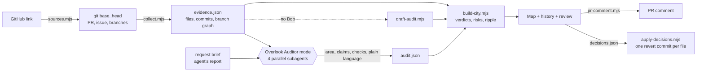

# Overlook

**AI said done. See what actually changed, compared with what was requested.**

Overlook audits a coding task that an AI agent has already finished. Paste a GitHub link to the agent's pull request and it checks the changes against **the request**, not just the diff, and every claim in the agent's report against git and the repository's own tests. For reviewers and team leads who approve agent pull requests, it answers four questions: did the agent stay inside the request, is its report true, do the original tests still pass, and what needs a decision.

**[▶ Live demo](https://overlook-lime.vercel.app/)** · **[📹 Video](#)** · **[📑 Slides](#)**


---

## The problem

AI coding agents finish whole tasks and end with a confident report: *"Done. I only changed the article views. No API changes. All tests pass."* A reviewer can trust the report or read the entire diff to find out whether it is true. Agents often touch code outside the request, such as a shared helper, an API serializer or a test assertion they "fixed". Those changes spread into screens and contracts nobody asked for, and they can collide with work other people merged while the agent was busy.

## What Overlook does

- **Paste a link and it runs.** A pull request, compare, commit or repository URL is enough. The range comes from the link, the **request** from the issue the pull request closes (`Fixes #724`), the **agent's report** from its description. For a repository link, Overlook audits the latest task: when the last commit is a merged pull request, that pull request with its own branch restored from GitHub (every commit and every merge), otherwise the latest run of commits by one author. A form to choose the commits and the scope yourself is one click away.
- **Evidence from git, not from a model.** A dependency-free collector reads `base..head` across the whole repository: changed files, the agent's commits with their own diffs, rewritten or weakened tests, API files, the import graph (JavaScript/TypeScript, Go and Python), and the **branch picture around the task** (the base branch, the agent's branch, other branches of the same period, their pull requests, and where the task was merged).
- **The codebase as a map.** A city: folders are blocks, files are buildings as tall as their lines of code, coloured by verdict (blue inside the request, red outside, amber may be affected). The requested area is a dashed blue fence. In a large repository the map opens on the work and the skyline grows taller, so a handful of changes among thousands of files still stands out.
- **Every commit against the one before.** Under the map, the history bar draws the branches as a git graph you can scroll. Play the task commit by commit, or click any commit, on any branch, to see what it changed against the commit before it. A merge inside the task's branch shows what it brought in, as another branch's work rather than the agent's. Click a branch to walk it; compare it with the task to find the files both sides changed, where a merge may conflict.
- **Tests are run, not reported.** Overlook runs the *original* tests (as they were at base) against the agent's code in a throwaway worktree, and again with the reviewer's reverts applied. Until they run, "all tests pass" stays *unverified*, or *partly true* when the agent rewrote or weakened a test.
- **Decide, revert, receipt.** Approve or revert each change outside the request. Decisions become one git revert commit per file, and a receipt goes on the pull request.
- **Bob proposes, a person confirms, git decides.** IBM Bob reads the request, proposes the requested area, splits the report into claims, writes executable checks for feature claims and plain-language notes. Every fact git can check is computed, never taken from Bob.

## What needs Bob, and what does not

Most of Overlook is deterministic. Four things need a reader of natural language: Bob, or a person.

| Part | Without Bob (logic only) | With the Overlook Auditor mode in Bob |
|---|---|---|
| Map, file tree, branch graph, replay, any commit against the one before | ✅ | ✅ |
| Branch comparison, merge-conflict risk, where a PR was merged | ✅ | ✅ |
| Inside / outside the requested area, may be affected (imports), risk and why | ✅ once the area is set | ✅ |
| Claims about scope, API, tests, new files | ✅ by wording patterns | ✅ |
| Running the original tests, reverts, receipt | ✅ | ✅ |
| **The requested area** | guessed from folder and file names in the request; confirm or edit it on the map | proposed from the request brief, with a rationale |
| **Splitting the report into claims** | one claim per sentence | atomic claims, typed |
| **Feature claims** ("fixed X") | shown as *unverified* | an executable check Bob writes; its exit code decides |
| **Plain-language notes** | none | one sentence per change for the person who asked |

A run without Bob is labelled **Draft audit** in the page.

## How IBM Bob is used

| Bob feature | What it does in Overlook | Where |
|---|---|---|
| **Custom mode** `overlook-auditor` | Reads everything but can only write audit output and checks in `out/` (`fileRegex`). An audit cannot "fix" what it audits | [`.bob/custom_modes.yaml`](.bob/custom_modes.yaml) |
| **Custom mode** `overlook-fixer` | Fix forward after a review: re-implement the request inside the requested area only, never weaken a test, then re-audit | [`.bob/rules-overlook-fixer/`](.bob/rules-overlook-fixer/) |
| **Mode rules** | The audit procedure: collect evidence first, never set a git-checkable verdict, never soften a finding | [`.bob/rules-overlook-auditor/`](.bob/rules-overlook-auditor/) |
| **Parallel subagents** | Fence, claims, executable checks and plain language run at the same time in clean contexts | step 3 of the auditor rules |
| **Skills** | `fence-mapper`, `claim-extractor`, `feature-check`, `business-translate` | [`.bob/skills/`](.bob/skills/) |
| **Document understanding** | The request brief is a `.docx` read directly by Bob | [`brief/GT-142.docx`](brief/GT-142.docx) |
| **MCP server** | `overlook_collect`, `overlook_build` (returns a map link), `overlook_fence`, `overlook_verify` (runs the tests), `overlook_receipt`, `overlook_apply`, `overlook_audits` | [`engine/mcp.mjs`](engine/mcp.mjs), [`.bob/mcp.json`](.bob/mcp.json) |
| **Slash commands** | `/audit`, `/verify`, `/fix-forward`, `/receipt` | [`.bob/commands/`](.bob/commands/) |
| **Project rules + AGENTS.md** | Keep the engine dependency-free, the UI static and the samples reproducible | [`.bob/rules/`](.bob/rules/), [`AGENTS.md`](AGENTS.md) |

### Built with Bob 2.0

Bob 2.0 was used at every stage of the project, not only inside the product.

- **Plan mode + document understanding:** Bob read the `.docx` brief and the spec and wrote the build plan, [`docs/PLAN.md`](docs/PLAN.md): phases, done checks, acceptance matrix and Bobcoin budget.
- **Agent mode + subtasks:** Bob built the first version phase by phase as seven subtasks, each in a fresh context, committing after every phase: its own configuration (modes, rules, skills), the scripted sample repository, the evidence collector, the schema and city builder, the receipt, revert and tests, and the UI.
- **Fixes across two accounts:** review findings were fixed by Bob in Agent mode, first in the same account (fix 1), then in a second team account (fix 2).
- **Budget:** three team accounts, **86.50 Bobcoins** in total; the two build accounts used their whole 40-Bobcoin allowance.

Task Ids, per-phase usage and session summary screenshots are in [`bob_sessions/`](bob_sessions/) and [`docs/BOB_SESSIONS.md`](docs/BOB_SESSIONS.md); files are mapped to Bob tasks in [`BOB_CONTRIBUTIONS.md`](BOB_CONTRIBUTIONS.md). How that first version grew into this one is in [`docs/EVOLUTION.md`](docs/EVOLUTION.md).

## Try it

**1. Live demo.** [overlook-lime.vercel.app](https://overlook-lime.vercel.app/) opens the GT-142 sample and the examples, with no sign-in and no keys. The site runs from any static host without the local server (`vercel.json` is included). It opens the examples only: no API and no model run there. Auditing a GitHub link needs the local server.

**2. Audit any GitHub link (local server).** Needs Node.js 22+ and git. There are no npm dependencies.

```bash
git clone https://github.com/asher-han/Overlook.git && cd Overlook
npm run site        # http://localhost:4280
```

Paste a pull request, compare, commit or repository URL. Overlook fetches it, audits it and opens the result, usually within seconds (a large repository takes a minute the first time it is cloned). This run is logic only, no model: it is labelled **Draft audit**. Set `GITHUB_TOKEN` to raise the GitHub API limit. To choose the commits, the request, the report or the area yourself, use *Choose them yourself*; to use Bob's audit, drop its `out/audit.json` in that form.

**3. With IBM Bob.** Open this repository in Bob IDE and select **Overlook Auditor**, then run:

```
/audit ../my-app <base-sha> brief/GT-142.docx "Done. I only changed the article views. No API changes. All tests pass."
```

Bob collects the evidence, runs the four subagents, writes `out/audit.json` and publishes the audit with `overlook_build`. You get a link to the map and the receipt.

## The workspace

One question per region, and every region follows what the history bar has in focus.


| Region | Question | What it shows |
|---|---|---|
| **Top** | Where do things stand? | A verdict that names the real issue (*Needs your review*, *Check the report*, *Ready to merge*, *Looks clean*; its reasons on hover), then four numbers: outside the request, may be affected, claims that hold, original tests. The branch line under the title says where the history bar stands |
| **Left** | What changed? | Only the files this task touched, as a folder tree, coloured by verdict; during a replay the current commit's files are lit. With another commit on screen, its files head the list |
| **Map** | Where? | The city with the requested area fenced in blue; Before / Compare / After; a Layers menu |
| **Right** | Is it OK? | One card at a time: the four questions (the worst claims first), or the selected file (why it was flagged, why a file may be affected, the diff, **Approve / Revert**), or the commit in focus against the one before |
| **Bottom** | How did it unfold? | The branch history (below). Panels switch on and off from the header (Shift+1 / Shift+3 / Shift+2) |

**Replay.** ▶ at the top right of the history bar plays the task commit by commit (from the start, or on from the commit on screen; 1× · 2× · 0.5×). The map holds still and lights each commit's buildings, the right card compares the commit with the one before, and the numbers on top count to the state at that commit.


**Any commit, any branch.** Click a commit on the base branch or another branch: the card, the map, the tree and the top line show what it changed against the commit before it, and which of those files this task changed too. On the map its files stand out in purple, named with their +/−. ← → and ▶ walk along that branch.


**Compare a branch with the task.** Files changed on both sides are where a merge may conflict. A green dashed line shows where the task itself was merged.


## Reading the map

| On the map | Meaning |
|---|---|
| Building height · bright top band | Lines of code · share of them this task changed (a changed file is never shorter than a small tower) |
| Blue building | Changed inside the requested area |
| Red building with a `!` pin | Changed outside the request: needs a decision |
| Amber building in a hatched ring, dotted arc | Not edited, but it imports a changed file, so it **may be affected** |
| Block sides in red, blue or amber | The folder holds a change outside the request, inside it, or a file that may be affected |
| Purple building | A file of the commit on screen that this task did not change (another branch's work, or a merge) |
| Dashed outline | New file, or its height before a revert |
| Dashed blue border | The requested area |
| Before / Compare / After | Base, a draggable split, or head (or the commit on screen) |

| In the history bar | Meaning |
|---|---|
| Rows | Other branches of the same period (with their PR number and state), the base branch, the audited branch |
| Dashed band · numbered circles | This task and its commits; red when a commit leaves the requested area |
| Green dashed line "PR #n merged" | Where the task reached the base branch (a merge, a squash or a rebase, found by patch id) |
| Purple ring on the base branch | A commit that merged some other pull request |
| Dashed purple circle in the task | A merge of the base branch into the task's branch: it shows what came in |

## Examples

**Real audits (3).** Finished agent tasks from public repositories (`samples/real/`, rebuilt with `npm run real`). The request and the agent's report are quoted from the source. The requested area, the claim types and the verdicts of feature claims were written by the Overlook team for these examples; every git-checkable verdict is computed from git.

| Example | Source | What Overlook finds |
|---|---|---|
| github-mcp-server #1645 | [github/github-mcp-server](https://github.com/github/github-mcp-server/pull/1645) (Copilot coding agent) | A compatibility fix that also rewrites a test expectation and five tool snapshots: 5 of 7 files outside the request; "tests pass" is only partly true |
| playwright-mcp #725 | [microsoft/playwright-mcp](https://github.com/microsoft/playwright-mcp/pull/725) (Copilot coding agent) | Inside the request, but the description still claims a change a later commit reverted; squash-merged a day later |
| Atlas · Bob session 10 | [chanjoongx/atlas](https://github.com/chanjoongx/atlas) (IBM Bob Hackathon, May 2026, 2nd place) | Committed straight to main; Bob stayed inside the four named files |


**Scripted examples (3, plus the GT-142 sample).** Repositories with scripted git history, audited by the same engine (`npm run sample`, `npm run examples`). After each task, a teammate lands a pull request on main and another branch is open, so the branch comparison has something to find. They are never presented as real agent runs.

| Example | Request | What it shows |
|---|---|---|
| GT-142 (the sample) | Relative publish dates | 4 of 6 changes outside the request, 3 files may be affected, a rewritten test, 1 of 4 claims holds; a teammate's PR on main changed a file the task also changed |
| `infra-drift` | SET-88 · Dark mode toggle in Settings | A small UI feature that also changes theme tokens, `.env.example`, `config/env.ts`, `docker-compose.yml`, Terraform and CI: 7 of 10 outside, 23 may be affected |
| `monorepo-scale` | ADM-310 · Rename Customer to Client | A rename in a 625-file monorepo that leaks into shared types, the public API and a migration: 13 outside, 94 may be affected |
| `clean-pass` | PAY-17 · Fix rounding in checkout total | The contrast: everything inside the request, every claim holds |


## How it works



Details and data contracts: [`docs/architecture.md`](docs/architecture.md) and [`SPEC.md`](SPEC.md).

## Repository layout

```
.bob/                  IBM Bob configuration: modes, rules, skills, slash commands, MCP server
AGENTS.md              guidance Bob loads in every mode
bob_sessions/          task session summary screenshots (every team member)
brief/GT-142.docx      the demo request
engine/                sources (GitHub links), collect (evidence + branch graph), core/city (verdicts, also in the
                       browser), build-city, draft-audit, verify (tests), apply-decisions, pr-comment, site, mcp, tests
schema/                audit.schema.json, the contract for Bob's audit output
samples/               the scripted GT-142 sample; examples/ scripted examples; real/ real audits of public agent tasks
ui/                    the site, static, no build: index.html, app.js (main, examples, routes), workspace.js (the
                       workspace), atlas3d.js (the map), history-graph.js (the branch history), map.js + iso.js
                       (city layout), layers.js (file roles), util.js, styles.css
docs/                  architecture, metrics, measurements, screenshots, EVOLUTION.md (prototype → this version),
                       prototype Bob log (BOB_SESSIONS.md, PLAN.md, prototype/)
```

## Tests

```bash
npm test          # node:test: collector, branch graph, merges, imports (JS/TS, Go, Python), verdicts, reverts,
                  # receipt, site API, MCP server, examples
npm run sample    # rebuild samples/city.sample.json from the scripted GT-142 repo
npm run examples  # rebuild the scripted examples
npm run real      # rebuild the real audits (clones the public repositories)
```

## Metrics

- **Public agent PRs, measured:** [`docs/measurements.md`](docs/measurements.md) runs the same rules over 22 merged pull requests by Copilot, Codex and Devin agents (GitHub API only, `npm run scan`). 15 of 20 changed a test file and 6 rewrote test assertions, none weakened. The "outside the request" rate there uses a fence guessed from the issue text, so it mostly shows why the requested area has to be confirmed by a person. The write-up explains this and lists the limitations.
- **Review time and accuracy:** method in [`docs/metrics.md`](docs/metrics.md). Numbers are filled in only after they are measured.

## Data sources & license

- The scripted examples are repositories created by this project. The real audits quote public repositories under the MIT or Apache-2.0 licence. No customer data, company-confidential information or personal information.
- License: [MIT](LICENSE).

## Team

<!-- names / handles -->
