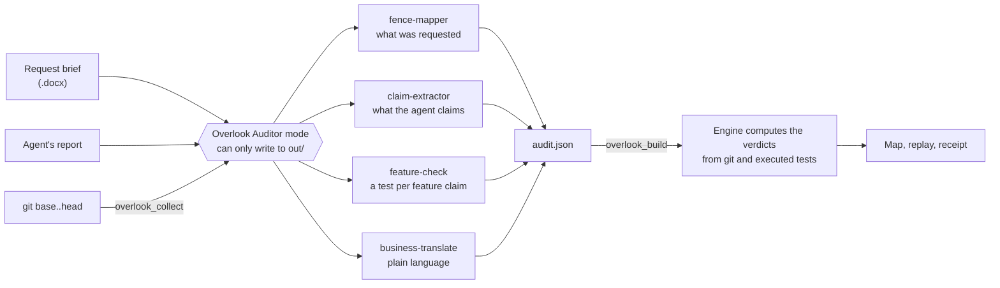
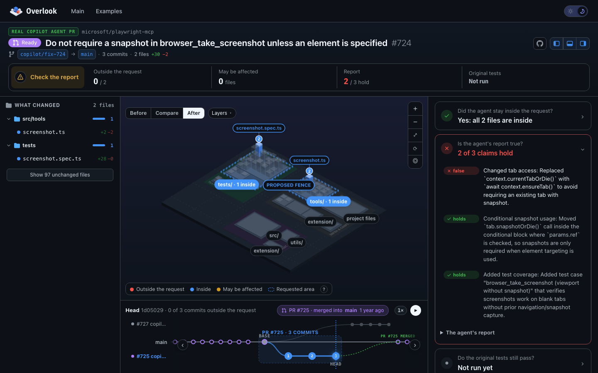
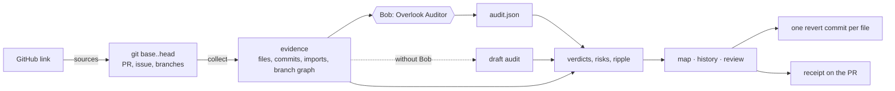

<div align="center">


# Overlook

### AI said done. See what actually changed.

**English** · [한국어](README.ko.md)

[](https://overlook-lime.vercel.app/)

[](#built-with-ibm-bob-20)
[](engine/test)
[](package.json)
[](LICENSE)

</div>

<br/>

AI agents can now take a ticket and come back with a finished pull request. The report always sounds great: *"Done. I only changed the article views. No API changes. All tests pass."* But is it true? Today you find out by reading the whole diff, or you don't find out at all.

**Overlook reviews the agent's work for you.** Paste a GitHub link. It shows what the agent actually changed, compares that with what was requested, and checks every sentence of the report against git. Then you decide what stays and what gets reverted.

<div align="center">


</div>

## What you see

A codebase turned into a city. Every folder is a block, every file a building. Blue changed inside the request, red changed outside it, amber wasn't touched but depends on something that was.

<table>
  <tr>
    <td width="50%" valign="top"><br/><b>Did the agent stay in scope?</b><br/>The requested area is fenced in blue. Anything red is a change nobody asked for.</td>
    <td width="50%" valign="top"><br/><b>What does this change break?</b><br/>Click a building: why it was flagged, which files depend on it, the diff, and Approve or Revert.</td>
  </tr>
  <tr>
    <td width="50%" valign="top"><br/><b>How did it get there?</b><br/>Replay the task commit by commit and watch where it drifted out of scope.</td>
    <td width="50%" valign="top"><br/><b>Will it collide with my team?</b><br/>Compare any branch with the task and see the files both sides touched.</td>
  </tr>
</table>

## Why it matters

Agents are fast, and they're usually right about the part they were asked to do. The trouble is the rest: a shared date helper "cleaned up", an API serializer tweaked on the way, a failing test assertion quietly rewritten until it passes. Each change looks harmless in a diff, and together they reach screens and contracts nobody meant to touch.

The people who feel this most are:

- **Reviewers and tech leads**, who now approve more agent pull requests than they can read line by line.
- **Product owners**, who wrote the request but can't read a diff to see whether what shipped is what they asked for.
- **Teams running agents in parallel**, whose branches overlap in ways nobody planned.

Overlook gives each of them four answers before merge: **did the agent stay in scope, is its report true, do the original tests still pass, and what needs a decision.**

## What we found

We didn't want to argue from a made-up demo alone, so we ran Overlook on real agent work too.

| | Result |
|---|---|
| **GT-142**, our scripted demo task | The report said "only the article views, no API changes, all tests pass". Overlook found **4 of 6 changed files outside the request**, **3 more files affected** through a shared helper, an API serializer change and a rewritten test. **1 of 4 claims held.** |
| **Copilot agent PR** in GitHub's own MCP server ([#1645](https://github.com/github/github-mcp-server/pull/1645)) | A compatibility fix that also rewrote a test expectation and five tool snapshots: **5 of 7 files outside the request**. "Tests pass" is only partly true. |
| **Copilot agent PR** in Microsoft's Playwright MCP ([#725](https://github.com/microsoft/playwright-mcp/pull/725)) | Stayed in scope, but the description still claims a change that a later commit reverted. |
| **Bob's own audits** of the three real tasks | Bob drew the requested area and split each report into claims. It caught a false claim in **both Copilot PRs**, each shown with Bob's reasoning and labelled as its judgement, next to the verdicts git computed. |
| **22 merged agent PRs** (Copilot, Codex, Devin), measured through the GitHub API | **15 of 20** changed a test file and **6** rewrote test assertions. Details and limits in [`docs/measurements.md`](docs/measurements.md); before/after numbers in [`docs/metrics.md`](docs/metrics.md). |

## Built with IBM Bob 2.0

Bob plays two roles in this project. It's the auditor inside the product, and it's the teammate we built the product with.

### Bob inside Overlook

We had one rule from day one: **evidence decides, Bob explains.** Anything git can prove, like which files changed, whether an API file was touched, or whether a test was rewritten, is computed by plain code with no model involved. Bob does the part that needs judgment: reading the request, drawing the line around what was asked, splitting the agent's report into checkable claims, writing a test for each feature claim, and explaining each change in plain words.



| Bob 2.0 feature | How Overlook uses it | Where |
|---|---|---|
| Custom modes | **Overlook Auditor** can read everything but write only audit output, so an audit can never quietly "fix" what it's auditing. **Overlook Fixer** re-does the work inside the requested area after a review. | [`.bob/custom_modes.yaml`](.bob/custom_modes.yaml) |
| Parallel subagents | Scope, claims, checks and plain language run at once, each in a clean context | [auditor rules](.bob/rules-overlook-auditor/01-evidence-first.md) |
| Skills | Four audit steps (`fence-mapper`, `claim-extractor`, `feature-check`, `business-translate`) and four one-call workflows (`audit`, `verify`, `receipt`, `fix-forward`) | [`.bob/skills/`](.bob/skills/) |
| Document understanding | The request arrives as a Word document, the way tickets often do | [`brief/GT-142.docx`](brief/GT-142.docx) |
| MCP server | Seven tools, from `overlook_collect` to `overlook_apply`, so Bob drives the engine directly | [`engine/mcp.mjs`](engine/mcp.mjs) |
| Slash commands | `/audit`, `/verify`, `/fix-forward`, `/receipt` | [`.bob/commands/`](.bob/commands/) |
| Mode rules | Collect evidence first, never set a verdict git can check, never soften a finding | [`.bob/rules-overlook-auditor/`](.bob/rules-overlook-auditor/) |

Without Bob, Overlook still runs on logic alone and labels the result **Draft audit**: the map, the history and the verdicts git can compute all work, but the requested area is only a guess and feature claims stay *unverified*. All three real audits below were done the full way: Bob ran the Overlook Auditor mode on each one, and it caught a false claim in both Copilot pull requests.

### How we built it with Bob

Three of our accounts ran Bob until each 40-Bobcoin budget was gone. We planned in Plan mode, wrote code and tests in Agent mode, ran the service to check it, and went back for fixes.

| | Bob 2.0 | What Bob did |
|:---:|---|---|
| **Start** | Agent mode, `office-insights` skill | Wrote the spec and the request brief as a Word document, and set up the first Auditor mode, rules and skills |
| **Plan** | Plan mode, document understanding | Read the brief and wrote [`docs/PLAN.md`](docs/PLAN.md): phases, done checks, an acceptance matrix and a Bobcoin budget |
| **Build** | Agent mode, 7 subtasks | Built the first version phase by phase, each subtask in a fresh context, with tests and a commit after every phase |
| **Fix** | Agent mode, a second account | Worked through the review list and regenerated the samples |
| **Audit** | Overlook Auditor mode | Ran the product's own audit on real work: three finished agent tasks in public repositories, finding a false claim in both Copilot PRs |
| **Review** | Agent mode | Read the whole finished codebase, removed dead code, added tests, and closed a hole where an agent could fake "tests pass" by rewriting the test script |

<table>
  <tr>
    <td align="center"><br/><sub>Start · 7.00</sub></td>
    <td align="center"><br/><sub>Plan and build · 39.55</sub></td>
    <td align="center"><br/><sub>Fix · 39.95</sub></td>
    <td align="center"><br/><sub>Review · 32.53</sub></td>
    <td align="center"><br/><sub>Audit · 17.12</sub></td>
  </tr>
</table>

**5 tasks · 136 Bobcoins.** We spent Bobcoins only where judgment was needed and kept every fact in plain code, and we opened a new task per phase so each context stayed small. Screenshots per teammate are in [`bob_sessions/`](bob_sessions/), Task Ids in [`docs/BOB_SESSIONS.md`](docs/BOB_SESSIONS.md), the files Bob wrote in [`BOB_CONTRIBUTIONS.md`](BOB_CONTRIBUTIONS.md), and the story from first prototype to this version in [`docs/EVOLUTION.md`](docs/EVOLUTION.md).

## Try it

**In your browser, right now.** [overlook-lime.vercel.app](https://overlook-lime.vercel.app/) opens the demo and every example. No sign-in, no keys.

**On any GitHub link.** You need Node.js 22+ and git. There's nothing to install.

```bash
git clone https://github.com/JONGSKY/Overlook.git
cd Overlook
npm run site
```

Open http://localhost:4280 and paste a pull request, compare, commit or repository link. Overlook reads the request from the issue the PR closes and the report from the PR description, and has the map up in seconds (a big repository takes about a minute the first time). Set `GITHUB_TOKEN` if you hit the GitHub API rate limit.

**With Bob.** Open the repository in Bob IDE, switch to the **Overlook Auditor** mode and run:

```
/audit ../my-app <base-sha> brief/GT-142.docx "Done. I only changed the article views. No API changes. All tests pass."
```

You get back a link to the map and a receipt you can post on the pull request.

## A closer look

**Any commit, on any branch.** Click a commit anywhere in the history bar and the whole screen switches to it: what it changed against the commit before, and which of those files this task also touched.


**Tests are run, not trusted.** Overlook runs the *original* tests, as they were before the agent started, against the agent's code in a throwaway worktree. Until they run, "all tests pass" is marked *unverified*.

**Decide, then act.** Approve or revert each change outside the request. Your decisions become one git revert commit per file, and a receipt with every verdict goes on the pull request.

<details>
<summary><b>How to read the map and the history bar</b></summary>
<br/>

| On the map | Meaning |
|---|---|
| Building height · bright top band | Lines of code · share of them this task changed |
| Blue / red building | Changed inside / outside the requested area (red ones get a `!` pin) |
| Amber building in a hatched ring | Not edited, but imports a changed file, so it may be affected |
| Colored block sides | The folder holds a change outside the request (red), inside it (blue), or an affected file (amber) |
| Purple building | A file of the commit on screen that this task didn't change |
| Dashed outline · dashed blue border | A new file or a pre-revert height · the requested area |

| In the history bar | Meaning |
|---|---|
| Numbered circles in a dashed band | This task's commits; red when a commit leaves the requested area |
| Green dashed line | Where the task was merged into the base branch |
| Purple ring · dashed purple circle | Another pull request merged on the base branch · the base branch merged into the task |

</details>

## Examples

<table>
  <tr>
    <td width="50%" valign="top"><br/><sub>A real Copilot agent PR, squash-merged into main a day later</sub></td>
    <td width="50%" valign="top"><br/><sub>Every audit as a card with a snapshot of its map</sub></td>
  </tr>
</table>

**Real audits** of finished agent work in public repositories. The request and the report are quoted from the source, and every verdict git can check is computed from git.

| Example | Source | What Overlook finds | Auditor |
|---|---|---|---|
| github-mcp-server #1645 | [github/github-mcp-server](https://github.com/github/github-mcp-server/pull/1645) (Copilot) | A compatibility fix that also rewrites a test expectation and five tool snapshots: 5 of 7 files outside the request; "tests pass" is only partly true | **IBM Bob** (Overlook Auditor mode) |
| playwright-mcp #725 | [microsoft/playwright-mcp](https://github.com/microsoft/playwright-mcp/pull/725) (Copilot) | Inside the request, but the description still claims a change a later commit reverted; squash-merged a day later | **IBM Bob** (Overlook Auditor mode) |
| Atlas · Bob session 10 | [chanjoongx/atlas](https://github.com/chanjoongx/atlas) (IBM Bob hackathon, May 2026, 2nd place) | Committed straight to main; Bob stayed inside the four files the prompt named | **IBM Bob** (Overlook Auditor mode) |

**Scripted scenarios**, audited by the same engine: the GT-142 demo, a UI feature that leaks into infrastructure (`infra-drift`), a rename across a 625-file monorepo (`monorepo-scale`) and a clean pass for contrast. The scripted ones are clearly labelled and never passed off as real agent runs.

## How it works



Everything is plain Node.js with no npm dependencies, and the UI is a static site with no build step. The same verdict code runs in the CLI, the local server, the MCP server and the browser. [`docs/architecture.md`](docs/architecture.md) walks through it, and [`SPEC.md`](SPEC.md) has the data contracts.

<details>
<summary><b>Repository layout and commands</b></summary>
<br/>

```
.bob/            Bob configuration: modes, rules, skills, slash commands, MCP server
bob_sessions/    Bob task session summaries from each team account
brief/           the demo request (GT-142.docx)
engine/          sources, collect, verdicts, draft audit, verify, reverts, receipt, site, mcp, tests
samples/         the GT-142 sample, scripted examples, real audits
ui/              the static site
docs/            architecture, plan, Bob sessions, evolution, measurements, screenshots
```

```bash
npm test          # 47 node:test tests
npm run site      # local site and API on http://localhost:4280
npm run mcp       # MCP server over stdio for Bob
npm run sample    # rebuild the GT-142 sample
npm run examples  # rebuild the scripted examples
npm run real      # rebuild the real audits
npm run scan      # measure public agent pull requests
```

</details>

## License

MIT, see [LICENSE](LICENSE). The real audits quote public repositories under MIT or Apache-2.0; no customer, confidential or personal data is used.

## Team

<div align="center">

**Time Has Density**

Seokyoung Cho · Jongho Lee · Chanyoung Han · Jeong Hae Jun

</div>
