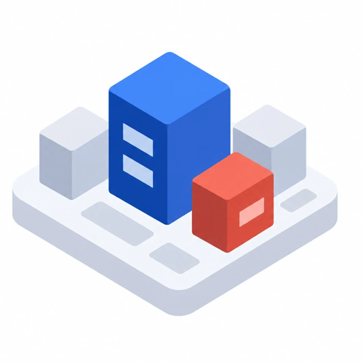
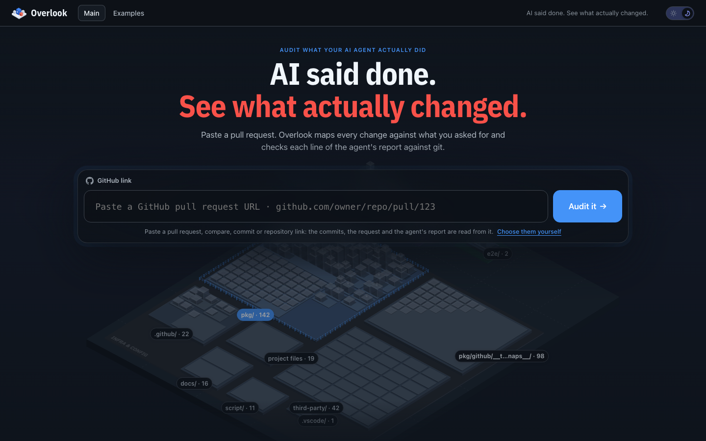
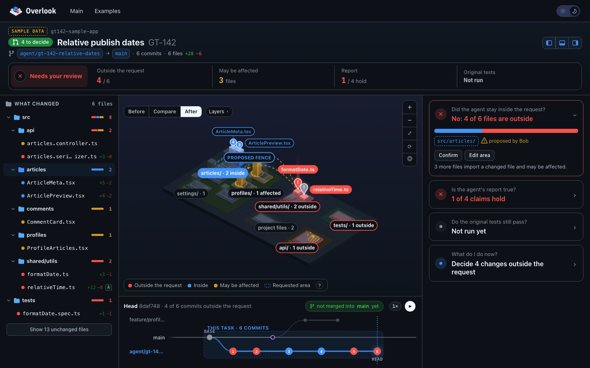
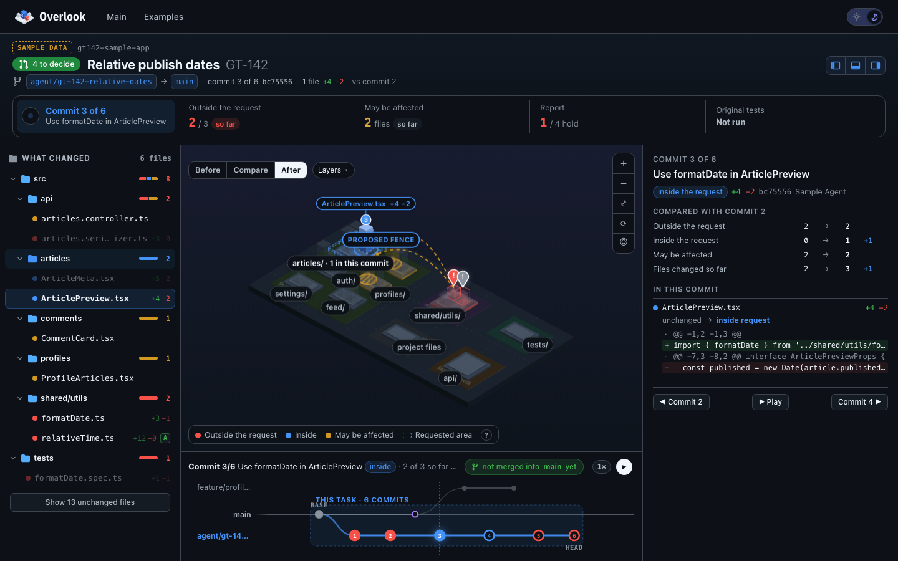
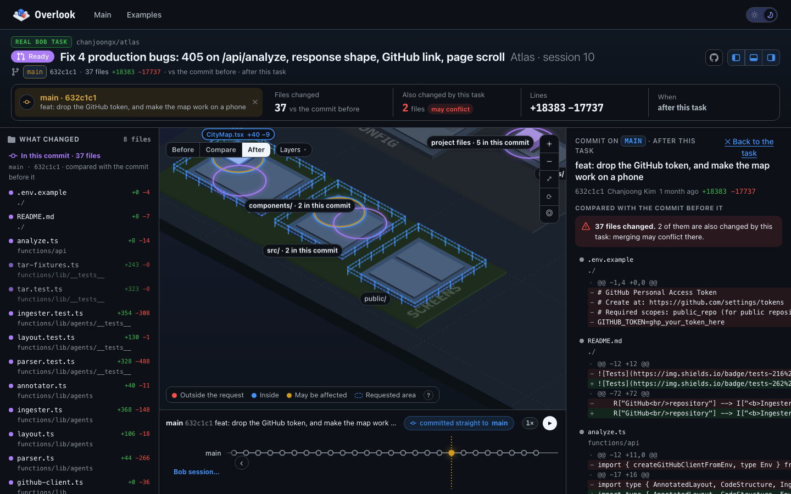
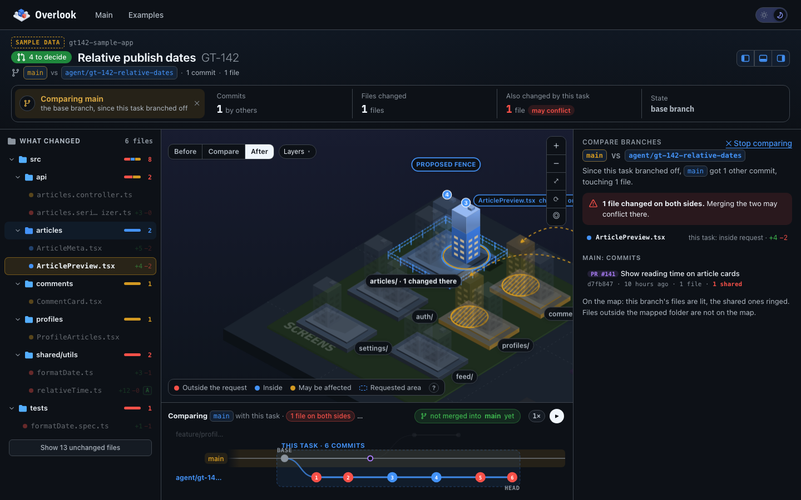
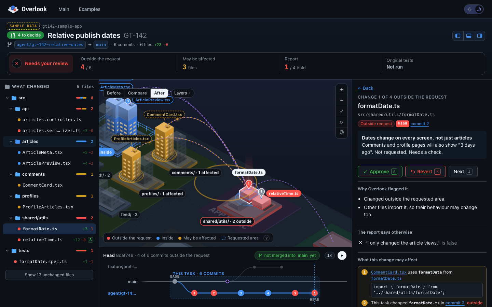
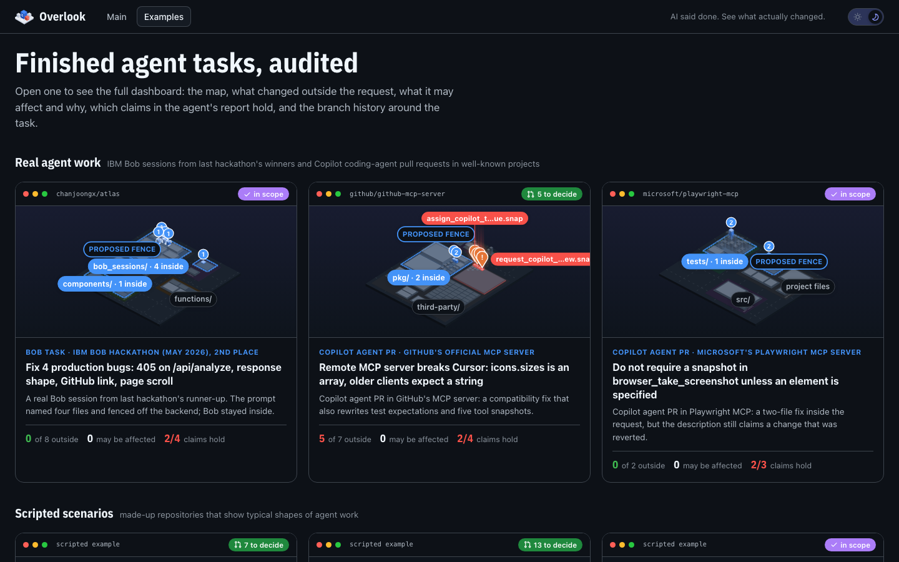
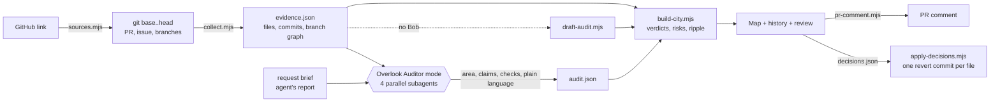

<div align="center">



# Overlook

**AI said done. See what actually changed.**

Audit a coding task an AI agent has already finished: what changed, how it compares with what was requested,<br/>and whether the agent's report is true.

**English** · [한국어](README.ko.md)

[](https://overlook-lime.vercel.app/)
[](#built-with-bob-20)
[](LICENSE)
[](package.json)
[](package.json)

[Live demo](https://overlook-lime.vercel.app/) · [Getting started](#getting-started) · [How IBM Bob is used](#how-ibm-bob-is-used) · [Examples](#examples) · [How it works](#how-it-works)



<sub>Made by team <b>Time Has Density</b> for the IBM Bob 2.0 hackathon.</sub>

</div>

---

## Why Overlook

AI coding agents finish whole tasks and end with a confident report: *"Done. I only changed the article views. No API changes. All tests pass."* A reviewer can trust the report or read the entire diff to find out whether it is true.

Agents often touch code outside the request: a shared helper, an API serializer, a test assertion they "fixed". Those changes spread into screens and contracts nobody asked for, and they can collide with work other people merged while the agent was busy. Overlook answers the four questions a reviewer has before merging:

1. **Did the agent stay inside the request?**
2. **Is its report true?**
3. **Do the original tests still pass?**
4. **What needs a decision?**

## What it does

- **Paste a link and it runs.** A pull request, compare, commit or repository URL is enough. The range comes from the link, the **request** from the issue the pull request closes (`Fixes #724`), the **agent's report** from its description. For a repository link, the latest task is audited; a merged pull request is restored from its own branch.
- **Evidence from git, not from a model.** A dependency-free collector reads `base..head`: changed files, commits, rewritten or weakened tests, API files, the import graph (JavaScript/TypeScript, Go, Python) and the branch picture around the task.
- **The codebase as a map.** Folders are blocks and files are buildings, coloured by verdict: blue inside the request, red outside, amber may be affected. The requested area is a dashed blue fence.
- **Every commit against the one before.** The history bar draws the branches as a git graph. Replay the task commit by commit, or click any commit on any branch to see what it changed.
- **Tests are run, not reported.** The *original* tests (as they were at base, with the base test command) run against the agent's code in a throwaway worktree. "All tests pass" stays *unverified* until they run.
- **Decide, revert, receipt.** Approve or revert each change outside the request. Decisions become one revert commit per file, and a receipt goes on the pull request.
- **Evidence decides, Bob explains.** IBM Bob reads the request, proposes the requested area, splits the report into claims and writes executable checks. Every fact git can check is computed, never taken from Bob.

## Getting started

### Live demo

[overlook-lime.vercel.app](https://overlook-lime.vercel.app/) opens the GT-142 sample and every example, with no sign-in and no keys. The static site has no API and runs no model.

### Audit any GitHub link

Requires Node.js 22+ and git. There are no npm dependencies.

```bash
git clone https://github.com/JONGSKY/Overlook.git
cd Overlook
npm run site        # http://localhost:4280
```

Paste a pull request, compare, commit or repository URL. Overlook fetches it, audits it and opens the result, usually within seconds (a large repository takes a minute the first time it is cloned). This run is logic only, without a model, and is labelled **Draft audit**.

> Set `GITHUB_TOKEN` to raise the GitHub API rate limit. *Choose them yourself* lets you set the commits, the request, the report or the area by hand, or load an `out/audit.json` written by Bob.

### With IBM Bob

Open this repository in Bob IDE, select the **Overlook Auditor** mode and run:

```
/audit ../my-app <base-sha> brief/GT-142.docx "Done. I only changed the article views. No API changes. All tests pass."
```

Bob collects the evidence, runs four subagents, writes `out/audit.json` and publishes the audit with `overlook_build`. You get a link to the map and the receipt.

## How IBM Bob is used

### In the product

| | Without Bob (logic only) | With the Overlook Auditor mode |
|---|---|---|
| Map, file tree, branch graph, replay, branch comparison | ✅ | ✅ |
| Inside or outside the requested area, may be affected, risk | ✅ once the area is set | ✅ |
| Running the original tests, reverts, receipt | ✅ | ✅ |
| **The requested area** | guessed from folder and file names in the request | proposed from the brief, with a rationale |
| **Splitting the report into claims** | one claim per sentence | atomic claims, typed |
| **Feature claims** ("fixed X") | shown as *unverified* | an executable check whose exit code decides |
| **Plain-language notes** | none | one sentence per change for the reviewer |

| Bob feature | What it does in Overlook | Where |
|---|---|---|
| **Custom modes** | `overlook-auditor` reads everything and can only write audit output in `out/`; `overlook-fixer` fixes forward inside the requested area only | [`.bob/custom_modes.yaml`](.bob/custom_modes.yaml) |
| **Mode rules** | Collect evidence first, never set a verdict git can check, never soften a finding | [`.bob/rules-overlook-auditor/`](.bob/rules-overlook-auditor/) |
| **Parallel subagents** | Area, claims, checks and plain language run at the same time | step 3 of the auditor rules |
| **Skills** | `fence-mapper`, `claim-extractor`, `feature-check`, `business-translate` | [`.bob/skills/`](.bob/skills/) |
| **Document understanding** | The request brief is a `.docx` read directly by Bob | [`brief/GT-142.docx`](brief/GT-142.docx) |
| **MCP server** | `overlook_collect`, `overlook_build`, `overlook_fence`, `overlook_verify`, `overlook_receipt`, `overlook_apply`, `overlook_audits` | [`engine/mcp.mjs`](engine/mcp.mjs), [`.bob/mcp.json`](.bob/mcp.json) |
| **Slash commands** | `/audit`, `/verify`, `/fix-forward`, `/receipt` | [`.bob/commands/`](.bob/commands/) |
| **Project rules, AGENTS.md** | Keep the engine dependency-free, the UI static and the samples reproducible | [`.bob/rules/`](.bob/rules/), [`AGENTS.md`](AGENTS.md) |

### Built with Bob 2.0

Bob 2.0 was used at every stage of the project, not only inside the product. Each of the three team accounts ran its own tasks until its 40-Bobcoin budget was spent.

| Stage | Bob 2.0 | What Bob did |
|---|---|---|
| Start | Agent mode, `office-insights` skill | Wrote the spec, the request brief as a Word document and the first Auditor mode, rules and skills |
| Plan | Plan mode, document understanding | Read the `.docx` brief and wrote [`docs/PLAN.md`](docs/PLAN.md): phases, done checks, acceptance matrix, Bobcoin budget |
| Build | Agent mode, seven subtasks | Built the first version phase by phase, each subtask in a fresh context, committing after every phase |
| Fix | Agent mode, a second account | Applied the review findings: test collection, bilingual text, revert commits, UI, samples |
| Review | Agent mode | Reviewed the finished codebase: dead code removed, fixes, stronger tests, and the original test command taken from base so a rewritten test script cannot fake a pass |

**Three accounts, four tasks, 119.03 Bobcoins.** Session summaries per account are in [`bob_sessions/`](bob_sessions/), Task Ids and per-phase usage in [`docs/BOB_SESSIONS.md`](docs/BOB_SESSIONS.md), the files Bob wrote in [`BOB_CONTRIBUTIONS.md`](BOB_CONTRIBUTIONS.md), and how the first version grew into this one in [`docs/EVOLUTION.md`](docs/EVOLUTION.md).

## A tour of the workspace



| Region | Question | What it shows |
|---|---|---|
| **Top** | Where do things stand? | A verdict (*Needs your review*, *Check the report*, *Ready to merge*, *Looks clean*), then four numbers: outside the request, may be affected, claims that hold, original tests |
| **Left** | What changed? | Only the files this task touched, as a folder tree coloured by verdict; with another commit on screen, its files come first |
| **Map** | Where? | The city with the requested area fenced in blue; Before / Compare / After; a Layers menu |
| **Right** | Is it OK? | One card at a time: the four questions, the selected file (why it was flagged, what it may affect, the diff, **Approve / Revert**), or the commit in focus |
| **Bottom** | How did it unfold? | The branch history; panels switch from the header (Shift+1 / Shift+3 / Shift+2) |

**Replay.** ▶ at the top right of the history bar plays the task commit by commit (1× · 2× · 0.5×). The map lights each commit's buildings, and the right card compares the commit with the one before.



**Any commit, any branch.** Click a commit on the base branch or another branch: the card, the map, the tree and the top line show what it changed against the commit before it, and which of those files this task changed too.



**Compare a branch with the task.** Files changed on both sides are where a merge may conflict. A green dashed line shows where the task itself was merged.



**Review a change.** Why it was flagged, what it may affect and why, the diff, then Approve or Revert.



<details>
<summary><b>Reading the map and the history bar</b></summary>

| On the map | Meaning |
|---|---|
| Building height · bright top band | Lines of code · share of them this task changed |
| Blue building | Changed inside the requested area |
| Red building with a `!` pin | Changed outside the request: needs a decision |
| Amber building in a hatched ring | Not edited, but imports a changed file, so it **may be affected** |
| Block sides in red, blue or amber | The folder holds a change outside the request, inside it, or a file that may be affected |
| Purple building | A file of the commit on screen that this task did not change |
| Dashed outline | A new file, or its height before a revert |
| Dashed blue border | The requested area |

| In the history bar | Meaning |
|---|---|
| Rows | Other branches of the same period, the base branch, the audited branch |
| Dashed band · numbered circles | This task and its commits; red when a commit leaves the requested area |
| Green dashed line "PR #n merged" | Where the task reached the base branch |
| Purple ring on the base branch | A commit that merged another pull request |
| Dashed purple circle in the task | A merge of the base branch into the task's branch |

</details>

## Examples

**Real audits.** Finished agent tasks from public repositories (`samples/real/`, rebuilt with `npm run real`). The request and the agent's report are quoted from the source; every verdict git can check is computed from git.

| Example | Source | What Overlook finds | Auditor |
|---|---|---|---|
| github-mcp-server #1645 | [github/github-mcp-server](https://github.com/github/github-mcp-server/pull/1645) (Copilot) | A compatibility fix that also rewrites a test expectation and five tool snapshots: 5 of 7 files outside the request; "tests pass" is only partly true | Overlook team |
| playwright-mcp #725 | [microsoft/playwright-mcp](https://github.com/microsoft/playwright-mcp/pull/725) (Copilot) | Inside the request, but the description still claims a change a later commit reverted; squash-merged a day later | Overlook team |
| Atlas · Bob session 10 | [chanjoongx/atlas](https://github.com/chanjoongx/atlas) (IBM Bob hackathon, May 2026, 2nd place) | Committed straight to main; Bob stayed inside the four files the prompt named | **IBM Bob** (Overlook Auditor mode) |

**Scripted examples.** Repositories with scripted git history, audited by the same engine (`npm run sample`, `npm run examples`). They are never presented as real agent runs.

| Example | Request | What it shows |
|---|---|---|
| GT-142 (the sample) | Relative publish dates | 4 of 6 changes outside the request, 3 files may be affected, a rewritten test, 1 of 4 claims holds |
| `infra-drift` | SET-88 · Dark mode toggle in Settings | A small UI feature that also changes theme tokens, `.env.example`, `config/env.ts`, `docker-compose.yml`, Terraform and CI: 7 of 10 outside |
| `monorepo-scale` | ADM-310 · Rename Customer to Client | A rename in a 625-file monorepo that leaks into shared types, the public API and a migration: 13 outside, 94 may be affected |
| `clean-pass` | PAY-17 · Fix rounding in checkout total | The contrast: everything inside the request, every claim holds |



## How it works



Details and data contracts: [`docs/architecture.md`](docs/architecture.md) and [`SPEC.md`](SPEC.md).

<details>
<summary><b>Repository layout and commands</b></summary>

```
.bob/                  IBM Bob configuration: modes, rules, skills, slash commands, MCP server
AGENTS.md              guidance Bob loads in every mode
bob_sessions/          Bob task session summaries, by team account
brief/GT-142.docx      the demo request
engine/                sources, collect, core/city, build-city, draft-audit, verify,
                       apply-decisions, pr-comment, site, mcp, scan, tests
schema/                audit.schema.json, the contract for Bob's audit output
samples/               the scripted GT-142 sample; examples/ scripted examples; real/ real audits
ui/                    static site, no build step: index.html, app.js, workspace.js, atlas3d.js,
                       history-graph.js, map.js, iso.js, layers.js, util.js, styles.css
docs/                  architecture, plan, Bob sessions, evolution, metrics, measurements, screenshots
```

```bash
npm test          # node:test: collector, branch graph, merges, imports, verdicts, verify, reverts,
                  #            receipt, site API, MCP server, examples
npm run site      # the local site and API at http://localhost:4280
npm run mcp       # the MCP server over stdio (configured in .bob/mcp.json)
npm run sample    # rebuild the GT-142 sample
npm run examples  # rebuild the scripted examples
npm run real      # rebuild the real audits (clones the public repositories)
npm run scan      # measure public agent pull requests through the GitHub API
```

</details>

## Metrics

- **Public agent pull requests, measured:** [`docs/measurements.md`](docs/measurements.md) runs the same rules over 22 merged pull requests by Copilot, Codex and Devin agents. 15 of 20 changed a test file and 6 rewrote test assertions; none weakened a test. The write-up explains the limitations.
- **Review time and accuracy:** the method is in [`docs/metrics.md`](docs/metrics.md). Numbers are filled in only after they are measured.

## Data and license

The scripted examples are repositories created by this project. The real audits quote public repositories under the MIT or Apache-2.0 licence. No customer data, company-confidential information or personal information is used.

Released under the [MIT License](LICENSE).

## Team

<div align="center">

**Time Has Density**

Seokyoung Cho · Jongho Lee · Chanyoung Han · Jeong Hae Jun

Repository contributors on GitHub: [@JONGSKY](https://github.com/JONGSKY), [@asher-han](https://github.com/asher-han)

</div>
