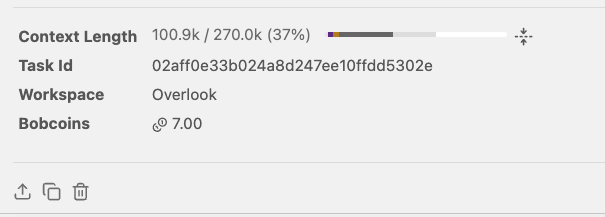
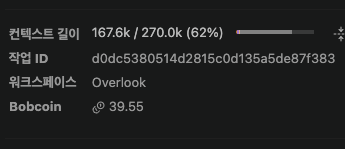
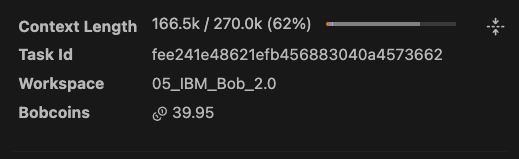
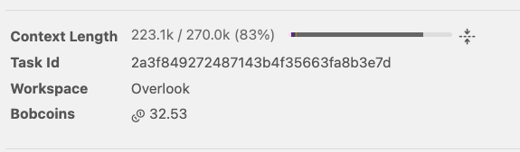
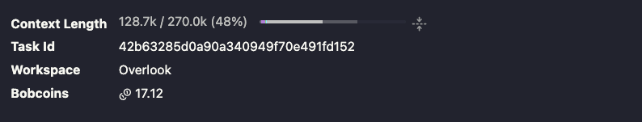
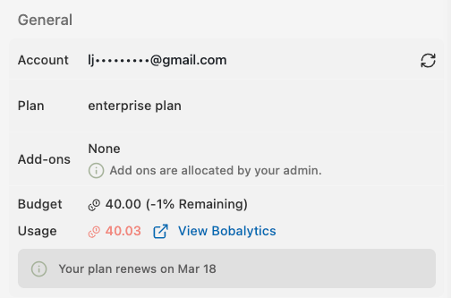
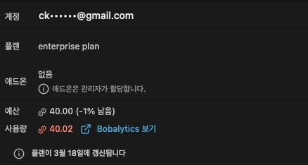
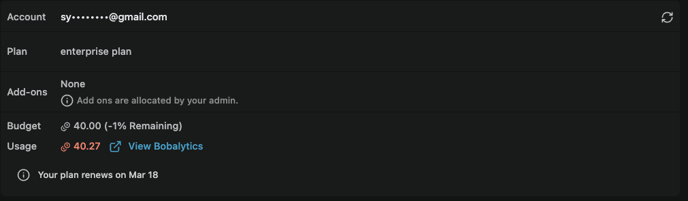

# Bob sessions

Team **Time Has Density** built Overlook with IBM Bob 2.0. Each screenshot below is the task session summary from Bob IDE, captured by the team member who ran the task in their own account. The three accounts on the budget pages below each used their full 40-Bobcoin budget.

| # | Captured by | Task | Bobcoins |
|---|---|---|---:|
| 00 | JONGSKY | Repository start: spec, request brief, Bob configuration | 7.00 |
| 01 | Asher | Plan, then build the first version in seven subtasks | 39.55 |
| 02 | seokyoung0213 | Fix the review findings | 39.95 |
| 03 | JONGSKY | Review and harden the finished codebase | 32.53 |
| 04 | tour_captain | Run the Overlook Auditor mode on 3 real agent PRs, fill the metrics | 17.12 |
| 05 | JONGSKY | Vercel deployment + run `/verify` on atlas example | — |
| | **Team** | **6 tasks** | **136.15+** |

---

## Task 00 · Repository start

**Captured by JONGSKY** · Sep 26 · 7.00 Bobcoins

- **Plan:** wrote the English spec (`SPEC.md`) and the build order the team followed.
- **Documents:** wrote the demo request `brief/GT-142.docx` as a Word document with the `office-insights` skill.
- **Code:** set up the repository and wrote the first Overlook Auditor mode, its rules and three skills.
- **Run:** started a local server so the team could open the first screens.

## Task 01 · Plan and build

**Captured by Asher** · Sep 26 · 39.55 Bobcoins

- **Plan:** in Plan mode, read the `.docx` brief and the spec and wrote [`docs/PLAN.md`](../docs/PLAN.md): phases, done checks, acceptance matrix and a Bobcoin budget.
- **Code:** switched to Agent mode and built the first version as seven subtasks, one commit per phase: Bob configuration, the scripted sample repository, the evidence collector, the audit schema and city builder, the receipt and one revert commit per file, and the map UI.
- **Tests:** wrote the `node:test` suite and ran `npm test` after every phase.
- **Run:** served the UI locally for the team to check the map, the replay and the inspector, then fixed what the check found (fix 1).

## Task 02 · Fix the review findings

**Captured by seokyoung0213** · Sep 26 · 39.95 Bobcoins

- **Code:** applied the review list: test files collected across the whole repository, bilingual text kept, real line breaks in revert commits, UI fixes.
- **Run:** re-ran the collector on the scripted repository and regenerated the samples.

## Task 03 · Review and harden

**Captured by JONGSKY** · Sep 27 · 32.53 Bobcoins

- **Review:** read through the whole codebase and removed dead code; fixed a double file read, an audit link path and a redraw helper; polished the README.
- **Tests:** fixed a temp-folder leak in the tests and added tests for the health check, static files, failing checks and test-diff analysis.
- **Security:** reproduced a way an agent could fake "tests pass" by rewriting the test script, then fixed it: the original test command is now read from the base commit.
- **Run:** ran the full test suite after each change, and ran the collector on a freshly built GT-142 sample repository.

## Task 04 · Prove Bob runs inside Overlook

**Captured by tour_captain** · Sep 27 · Task Id `42b63285d0a90a340949f70e491fd152` · 17.12 Bobcoins

- **Skills:** committed four new skills that were untracked: `audit`, `verify`, `receipt`, `fix-forward` — the one-call workflows that let a reviewer run the full audit cycle from a single command.
- **Audit (1 of 3) — Atlas · Bob session 10:** switched to Overlook Auditor mode and ran the full procedure on `chanjoongx/atlas` (IBM Bob hackathon 2nd place). Collected evidence with `overlook_collect`, drew the fence from the prompt ("Do not touch other files. Backend MUST remain unchanged."), extracted 4 typed claims, wrote feature checks, computed verdicts with `overlook_build`. Result: **0 of 8 files outside the fence** — Bob stayed exactly inside the four files the prompt named. Saved as `samples/real/atlas-production-fixes/audit.json` with `"bob_generated": true`.
- **Audit (2 of 3) — github-mcp-server #1645 (Copilot):** ran the same procedure on GitHub's own MCP server PR. Result: **5 of 7 files outside the fence**, 1 test rewritten, **1 false claim** — "Icon field is internal metadata; no user-facing documentation required" is contradicted by the five tool-schema snapshots the PR also changed. The previous team-written audit had `falseClaims: 0`; Bob found the contradiction git proves.
- **Audit (3 of 3) — playwright-mcp #725 (Copilot):** audited Microsoft's Playwright MCP server PR. The agent's own third commit ("Revert tab access to use currentTabOrDie() as requested") undid its first change, but the PR description was never updated. Bob flagged it: **1 false claim** — "Replaced `currentTabOrDie()` with `await context.ensureTab()`" is false in the merged code. Previous audit: `falseClaims: 0`.
- **Metrics:** filled `docs/metrics.md` with real numbers from the GT-142 sample (34 diff lines → 0 to read, 2 false claims auto-caught) and the 3 real audits. Strengthened `docs/measurements.md`: the "14 of 16 outside" headline from the draft-heuristic scan is corrected to "6 of 16" with a Bob-vs-heuristic comparison table.
- **Push:** resolved a merge conflict in both READMEs (origin had rewritten them while this task ran), kept origin's cleaner layout, and pushed.

---

## Budgets

Each team member's Bob account page: a 40.00 Bobcoin budget, fully used. Emails are partly hidden.

| Account | Used |
|---|---:|
| JONGSKY | 40.03 |
| Team account (ck…) | 40.02 |
| Team account (sy…) | 40.27 |
| **Total** | **120.32** |

The account pages count every task an account ran, so the total is a little above the sum of the four tasks above.

## Task 05 · Vercel deployment + /verify on atlas

**Captured by JONGSKY** · Sep 27

Full write-up: [`bob_sessions/timehasdensity_task05_vercel_and_verify.md`](timehasdensity_task05_vercel_and_verify.md)

- **Deploy:** added `api/` Serverless Functions for every endpoint; routed sub-paths in `vercel.json`; switched `out/` storage to `/tmp` when `VERCEL=1`; added `.env.example`.
- **Verify:** fixed `detectTestCommandAtBase` to prefix bare binary names with `./node_modules/.bin/`; added `npm install` fallback when `npm ci` fails due to lock file drift.
- **Result:** `crossTests` on `chanjoongx/atlas` — 78 tests, 4 files, all passed. `atlas-production-fixes.city.json` updated with `runs.cross`; `tests_pass` claim verdict: `unverified → true`.

---

Task Ids and per-phase usage: [`docs/BOB_SESSIONS.md`](../docs/BOB_SESSIONS.md). Files Bob wrote: [`BOB_CONTRIBUTIONS.md`](../BOB_CONTRIBUTIONS.md).
