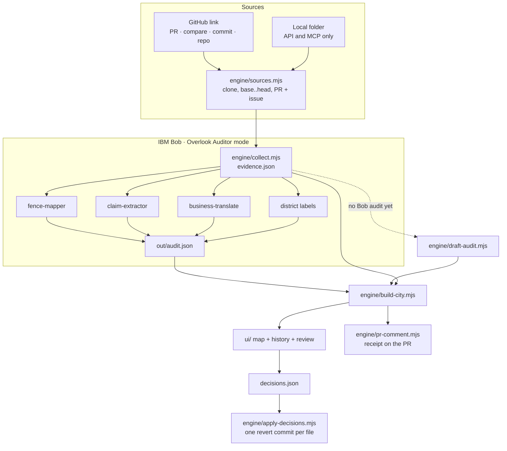

# Architecture

## Pipeline

## Components

| Component | Role | Model involved? |
|---|---|---|
| `engine/collect.mjs` | Files, status, LOC, commits as steps, diffs, test rewrites, API files, import graph, and the branch graph around the task (base branch, audited branch, other branches of the period, PR numbers from commit subjects, where the task landed by patch id, what any commit changed) | No |
| `engine/build-city.mjs` | Fence membership, affected files, review items with risk, claim verdicts for git-checkable types, totals | No |
| `engine/pr-comment.mjs` | Receipt markdown | No |
| `engine/apply-decisions.mjs` | Reverts, one commit per file, refuses a dirty tree | No |
| `engine/sources.mjs` | GitHub URL parsing, clone/fetch into `out/repos/`, PR merge base, the issue a PR closes, PR titles and states for the branch graph, the latest task of a repository without a range (`suggestTask`), local folders (API and MCP) | No |
| `engine/draft-audit.mjs` | Draft fence and claims when no Bob audit exists: the fence from folder and file names in the request, one claim per sentence typed by wording | No (wording rules only) |
| `engine/core/city.mjs` | The verdict engine without Node APIs: shared by the CLI, the servers and the browser (live fence edits) | No |
| `engine/verify.mjs` | Runs the repository's own tests in a throwaway worktree: original tests on head, tests after reverts, feature checks | No |
| `engine/site.mjs` | Static site + local API (`/api/source`, `/api/audit`, `/api/audits`, `/api/folders`, `/fence`, `/verify`, `/receipt`) | No |
| `engine/mcp.mjs` | The same engine as MCP tools for Bob | No |
| Overlook Auditor mode | Proposes the fence from the brief, atomic claims, executable checks for feature claims, plain-language notes, district labels | **Bob** |
| Overlook Fixer mode | After a review: re-implements the request inside the confirmed area only, then re-audits | **Bob** |

## Who decides what

| Decision | Made by |
|---|---|
| What changed, where, in which commit | git (`collect.mjs`) |
| Which area the request covers | Bob proposes, the reviewer confirms or edits (live recompute) |
| Scope, API, new-file and test-rewrite verdicts | git (`core/city.mjs`) given the confirmed area |
| "Tests pass" | the original tests, executed on the new code (`verify.mjs`) |
| Feature claims | an executable check Bob wrote, executed by Overlook; Bob's judgement only when no check is possible (labelled) |
| Keep or revert each change | the reviewer |

## Why the split

- **Trust.** A reviewer can check every fact against git. Bob's contribution is interpretation, and it is labelled as such in the UI (evidence tags `git-diff`, `test-diff`, `import-graph`, `bob-judgement`).
- **Cost.** Deterministic work spends no Bobcoins. Bob is used where judgement matters.
- **Safety.** The auditor mode cannot write outside `out/`, and reverts only happen after a human exports decisions.

## The workspace

`ui/workspace.js` answers one question per region: the top line (where things stand), the file tree on the left (what changed), the map (where), the review panel on the right (is it OK: the four questions, a file, or the commit in focus) and the history bar at the bottom (how it unfolded). All of them follow one focus: the task at base or head, a commit of the task (the replay), any other commit of the picture (against the commit before it), or a branch compared with the task. `ui/app.js` holds Main (paste a link, a live map of real audits), the Examples page and the routes (`/`, `/examples`, `/sample`, `/sample/<id>`, `/audit/<id>`; `?step=`, `?look=<sha>`, `?lane=<id>`, `?file=<path>` open a focus directly).

## The history bar

`ui/history-graph.js` draws `graph` from the evidence as a git graph: rows for up to three other branches, the base branch and the audited branch; commits left to right, parents first, the task's commits with more room; forks and merges as curves; the task in a dashed band, where it landed as a green dashed line. It scrolls sideways (drag, wheel, ‹ ›) with the branch names pinned, and reports clicks: a commit of the task moves the replay, any other commit opens it, a branch opens its first commit.

## The map

`ui/atlas3d.js` draws the city on a canvas: `ui/map.js` lays out the blocks (folders) and lots (files) by role (`ui/layers.js`: screens, app logic, tests, server & data, infra & config), packed tightly by `pack` in `ui/iso.js`; buildings are as tall as their lines of code, with a bright top band for the share changed, coloured by verdict. It draws base and head (or the commit on screen) into two buffers, so Before / Compare / After is a clip at a draggable divider. A replay frames every file the task touches once and then holds still while each commit's buildings light up. The workspace remembers the camera per audit; the previews on Main and Examples never do.
